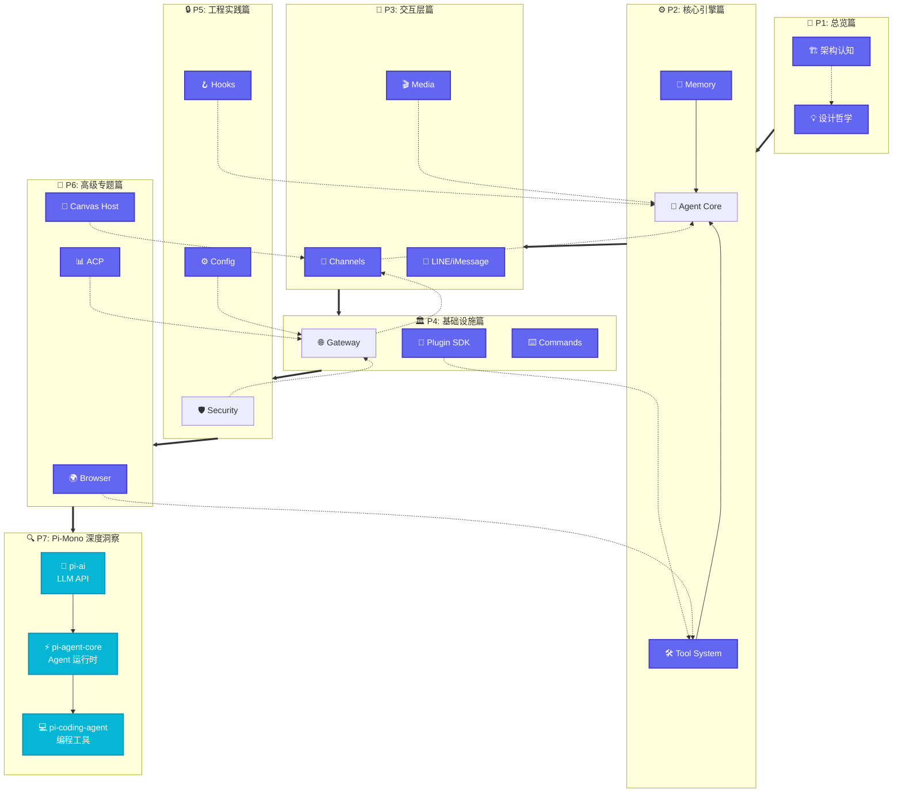

# OpenClaw Deep Dive

## 七大部分导航

## 快速开始

本文档基于 OpenClaw 源码分析，所有结论均附带路径引用。

| 部分 | 内容 | 状态 |
|------|------|------|
| P1: 总览篇 | 架构认知、设计哲学 | ✅ 已完成 |
| P2: 核心引擎篇 | Agent Core、Memory、Tool System、Context Engine、Providers | ✅ 已完成 |
| P3: 交互层篇 | Channels、Media、LINE/iMessage、TTS、移动端 | ✅ 已完成 |
| P4: 基础设施篇 | Gateway、Plugin SDK、CLI、Commands、Sessions、TUI 等 | ✅ 已完成 |
| P5: 工程实践篇 | Security、Hooks、Config、密钥管理、日志、Daemon | ✅ 已完成 |
| P6: 高级专题篇 | Browser、Canvas Host、ACP | ✅ 已完成 |
| P7: Pi-Mono 篇 | pi-ai、pi-agent-core、pi-coding-agent 深度洞察 | 🚀 进行中 |

## 贡献指南

欢迎提交 PR 补充完善各章节内容。
