# OpenClaw 架构总览（源码事实对齐）

本文严格基于源码与官方文档进行综述，所有结论附带可点击路径引用，避免臆测。

---

## 定位与边界

- 产品本体：个人助手平台（Gateway 仅是控制平面），支持本地优先与自托管。参见 `README`。
- 控制平面：单宿主 Gateway（WS+HTTP）汇聚客户端与设备，路由到智能体运行时与工具。参见 `server`。
- 交互入口：CLI、本地 Web UI、平台节点（macOS/iOS/Android），均通过 WebSocket 连接 Gateway。参见 `cli/program`、`gateway client`。

---

## 架构主图

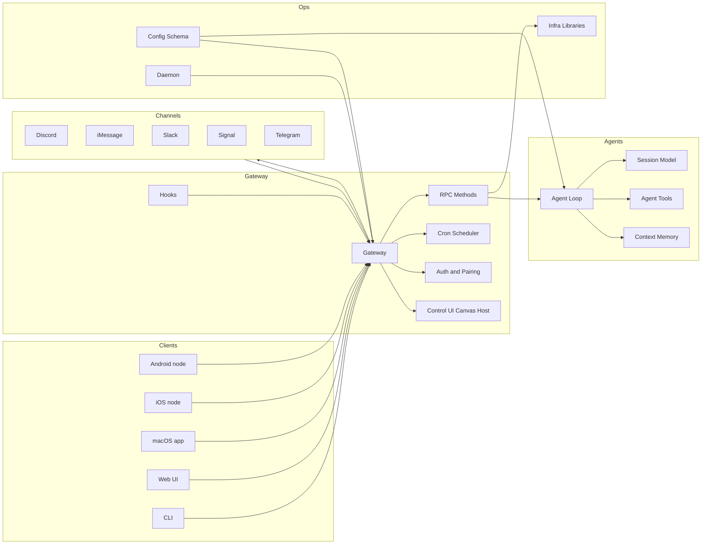

---

## 分层与模块（职责与路径）

- Gateway 网关
  - 职责：WS/HTTP 服务、认证与配对、RPC 方法路由、事件广播、节点与 UI 承载。
  - 代码： `server`、`auth`、`server-methods`、`protocol`。
- Agents 智能体
  - 职责：会话循环、工具调用、上下文/记忆接入、隔离策略。
  - 代码： `agents 目录`、`server-methods/agent`。
- CLI 命令行
  - 职责：命令注册与懒加载、本地/远程操作、Gateway RPC。
  - 代码： `entry`、`program`、`gateway-rpc`。
- Config 配置
  - 职责：加载/合并/校验、默认值、路径与会话相关配置。
  - 代码： `config`、`schema help`。
- Cron 调度
  - 职责：定时任务持久化与执行、隔离会话运行、运行日志。
  - 代码： `cron service`、`cron-tool`。
- Daemon 守护进程
  - 职责：跨平台服务安装/控制、状态检查与重启。
  - 代码： `daemon service`。
- 渠道适配（举例）
  - Discord： `client`、`monitor/agent-components`。
  - iMessage（imsg）： `client`。
- Hooks 钩子
  - 职责：命令/会话/网关/消息事件监听与插件生命周期钩子。
  - 代码： `internal-hooks`、`plugins/hooks`。
- Infra 基础设施
  - 职责：HTTP/重启/安全文件操作/退避/环境等通用能力。
  - 代码： `fetch`、`restart`、`binaries`。

---

## 消息流与调用链

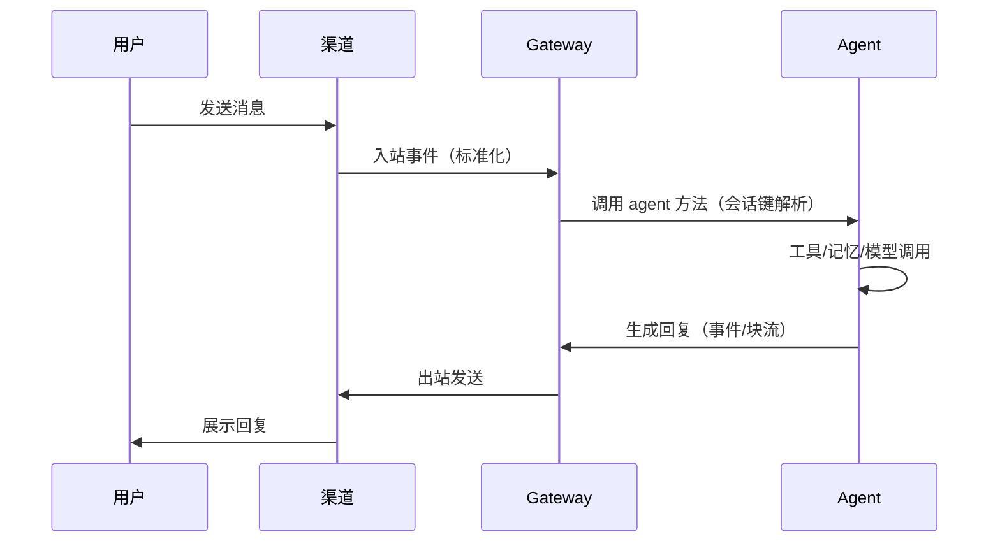

- 网关方法路由：参见 `server-methods` 与 `agent 方法`。
- 渠道组件交互：参见 `discord/monitor/agent-components`。

---

## 配置与安全（要点）

- 配置入口与校验： `config`、`schema help`；详见 Docs 的配置参考。
- 认证与配对： `auth`，默认严格策略（令牌/密码/配对码）。
- 会话隔离与沙箱：配置项在 Docs 中详述（Docker 沙箱与 allow/deny 列表）；源码入口参见 `agents/sandbox`。

---

## 运维与可观测性

- 守护进程安装与管理： `daemon service`。
- 日志与事件：网关端事件/WS 日志，参见 `ws-log` 与 Docs 的 logging。
- 热重启与退避： `infra/restart`。

---

## 研读路径（可复现）

- 从入口开始：阅读 `entry` → `cli/program`。
- 网关装配：阅读 `server` → `server-methods`。
- 渠道交互：阅读 `discord/client` 与 `imessage/client`。
- 调度与钩子：阅读 `cron/service`、`hooks/internal-hooks`。

---

## 参考文档（精选）

- `Docs Index`
- `Gateway 运行手册（中文）`
- `CLI 参考（中文）`
- `Hooks（中文）`
- `Cron jobs`
- `Gateway 配置参考`

---

（本章将随仓库结构演进持续更新；若路径在不同分支存在差异，请以实际代码为准。）

---

## 核心架构可视化

> 以下图表为全书核心可视化资产，覆盖系统全景、数据流、部署、Agent 核心、插件、消息处理、安全与扩展性八个维度。

### 系统全景图

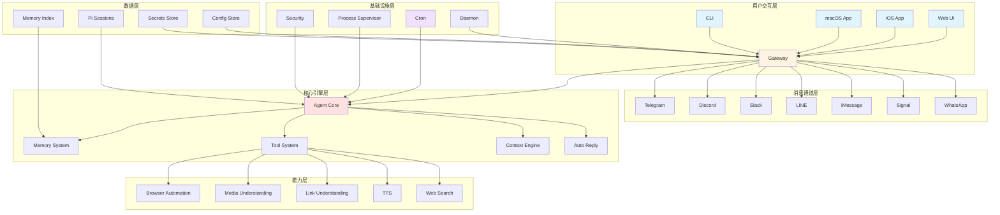

**关键要点：** Gateway 是整个系统的唯一入口，所有客户端（Web/iOS/macOS/CLI）和消息通道（Telegram/Discord 等）都通过它汇聚。Agent Core 是核心枢纽，Memory、Tool、Context Engine 均围绕它展开。基础设施层（Cron/Daemon/Security）以"推送"方式驱动 Agent，而非 Agent 主动拉取——这是一个事件驱动的控制平面设计。

### 数据流全景图

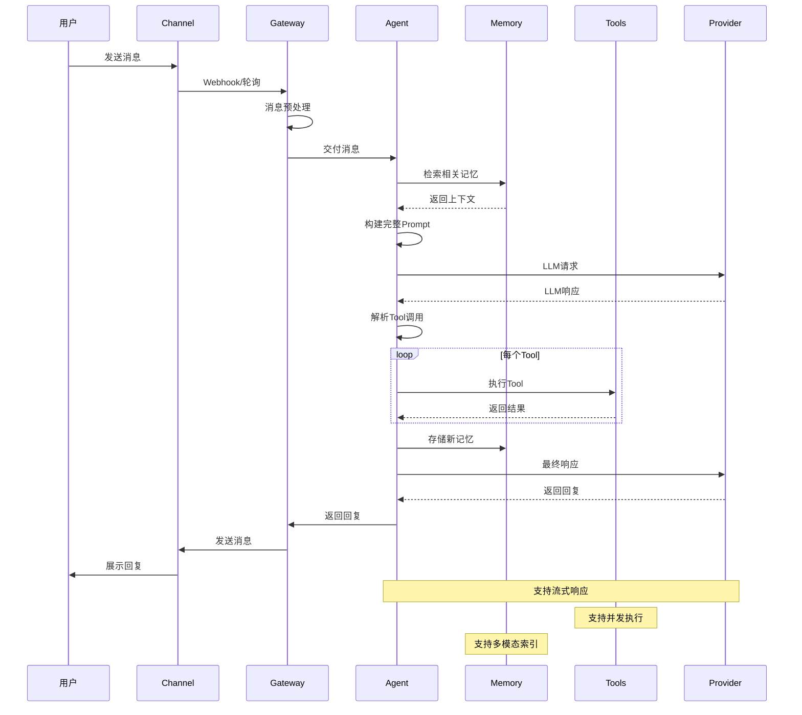

**关键要点：** 消息从 Channel 进入后，Gateway 做预处理（标准化格式、鉴权），再交付给 Agent。Agent 的核心循环是：检索记忆 → 构建 Prompt → 调用 LLM → 解析 Tool 调用 → 循环执行 Tool → 最终回复。注意 Tool 执行是一个循环，LLM 可以多轮调用工具直到得出最终答案。Memory 在两个节点介入：请求前检索上下文，回复后存储新记忆。

### 部署架构图

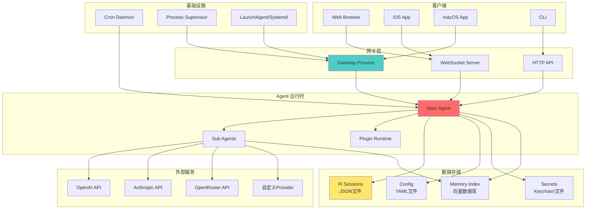

**关键要点：** 部署上 Gateway 是单进程，WebSocket Server 和 HTTP API 是它的两个接入面——前者服务 Web/移动客户端，后者服务 CLI。数据存储全部是本地文件（JSON/YAML/Keychain），没有外部数据库依赖，这是"本地优先"设计的直接体现。LaunchAgent/Systemd 负责开机自启，Process Supervisor 负责运行时守护，两者职责分离。

### Agent 核心架构图

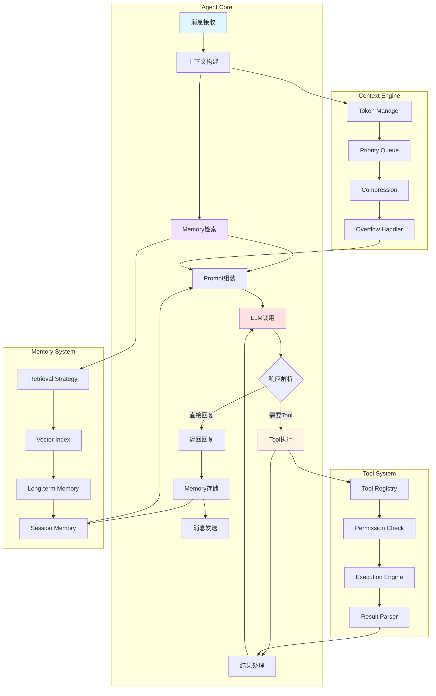

**关键要点：** Agent Core 的循环核心是 LLM 调用 → 响应解析 → Tool 执行 → 再次 LLM，这个 loop 可以多轮迭代。Tool System 内部有四层：Registry（注册表）→ Permission Check（权限校验）→ Execution Engine（执行）→ Result Parser（结果解析），权限校验在执行前强制介入，不可绕过。Context Engine 的四层（Token Manager → Priority Queue → Compression → Overflow Handler）解决的是"上下文窗口有限"这个根本问题，优先级队列决定了哪些内容在 token 不够时被压缩或丢弃。

### 插件系统架构图

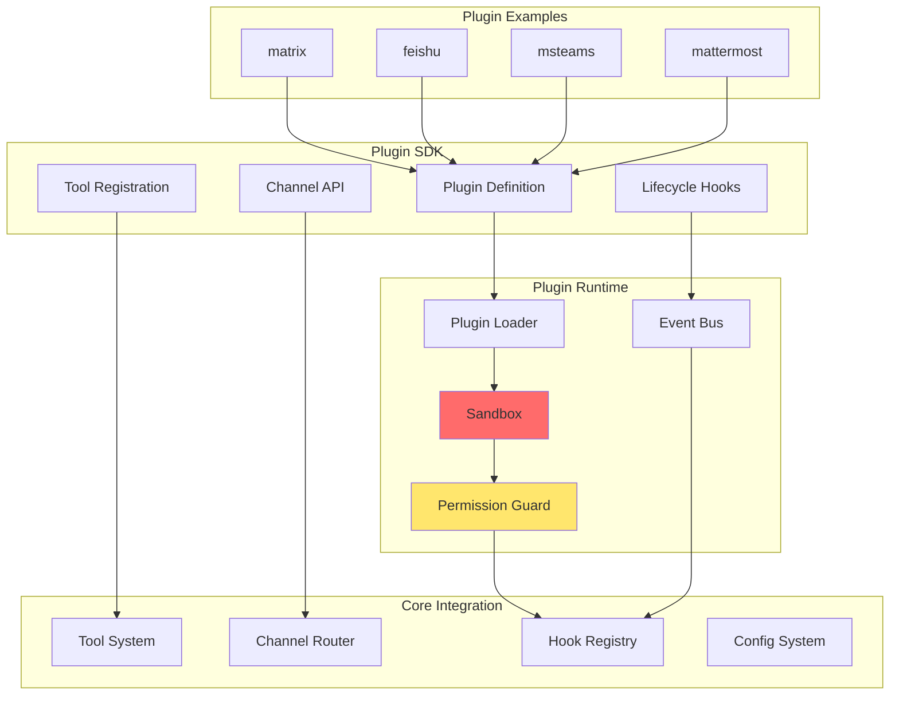

**关键要点：** 插件通过 SDK 定义自身（Plugin Definition），经由 Runtime 的 Sandbox + Permission Guard 双重隔离后才能接入核心系统。插件可以注册 Tool、接入 Channel、监听 Hook，但每条路径都经过 Core Integration 层的门控。Sandbox（红色标注）是安全边界的核心，插件代码在沙箱内运行，无法直接访问宿主进程的敏感资源。matrix/feishu/msteams/mattermost 是典型的渠道类插件示例。

### 消息处理状态机

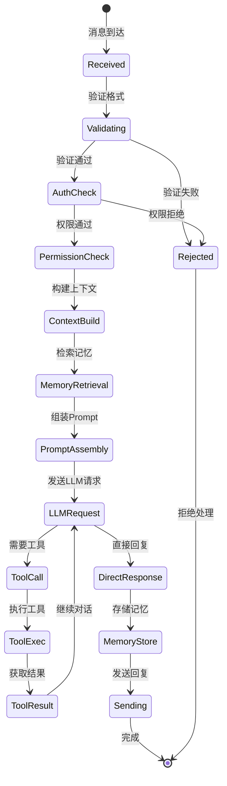

**关键要点：** 消息处理是一条严格的单向流水线，每个阶段都有明确的成功/失败分支。认证（AuthCheck）和权限（PermissionCheck）是两个独立的关卡，分别对应"你是谁"和"你能做什么"。Tool 调用后会循环回 LLMRequest，这意味着一条消息可以触发多轮 LLM 调用。整条链路的任何失败都直接走向 Rejected，不会有部分成功的中间态。

### 安全架构图

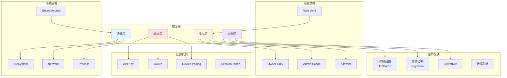

**关键要点：** 安全体系分四层纵深防御：认证（你是谁）→ 授权（你能做什么）→ 沙箱（你能访问什么）→ 加密（数据如何保护）。授权策略中 Owner Only 是最严格的级别，敏感操作默认只有 owner 可执行。SecretRef 机制让配置文件中不出现明文密钥，而是引用 Keychain 中的条目。Rate Limit 挂在授权层而非网络层，意味着限流是按身份而非按 IP 执行的。

### 扩展性架构图

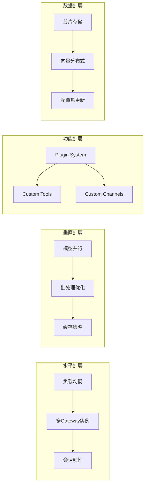

**关键要点：** 扩展性分四个维度，但优先级不同。功能扩展（Plugin/Custom Tools/Channels）是当前版本的主要扩展路径，成本最低。水平扩展（多 Gateway + 负载均衡）需要解决会话粘性问题——因为 Pi Sessions 是本地文件，多实例间需要共享存储才能真正水平扩展。垂直扩展和数据扩展（向量分布式）更多是面向未来的演进方向，当前单机部署场景下意义有限。

---

## 最新更新（2026-03-24）

### 规模跃升：从 30 个扩展到 85 个扩展

`extensions/` 目录已从约 30 个扩展扩展至 **85 个**，覆盖三大类：

**新增渠道（13 个）**：msteams、feishu、matrix、synology-chat、nextcloud-talk、irc、nostr、tlon、twitch、zalo/zalouser、googlechat、mattermost、bluebubbles

**新增 Provider（25+ 个）**：anthropic-vertex、xai、minimax、mistral、chutes、byteplus、cloudflare-ai-gateway、groq、huggingface、kilocode、kimi-coding、nvidia、opencode、openrouter、perplexity、qianfan、sglang、together、venice、vercel-ai-gateway、vllm、volcengine、xiaomi、zai 等

**新增能力扩展**：image-generation（图像生成）、web-search（统一 Web 搜索抽象，含 brave/firecrawl/exa/duckduckgo/tavily）、speech（Microsoft/ElevenLabs 独立 Extension）

### 架构新增：Subagent 系统

Agent 运行时新增 Subagent 支持，主 Agent 可通过 `subagents` 工具派生子 Agent 并行执行任务：

```
主 Agent → subagents 工具 → 子 Agent 实例（独立会话/工具权限）
                          → agents_list 工具（查询运行中的 Agent）
                          → sessions_yield 工具（让出会话控制权）
```

子 Agent 拥有独立的工具权限集合，通过 Tool Policy Pipeline 控制可用工具范围。

### 架构新增：OpenAI 兼容 API 端点

Gateway 新增 OpenAI 兼容 HTTP 端点（`/v1/chat/completions` 等），允许任何支持 OpenAI API 的客户端直接接入 OpenClaw，无需修改客户端代码。

### 架构新增：macOS Companion App

macOS 客户端从普通 App 升级为 Companion App，新增：
- Voice Wake（语音唤醒）
- Push-to-Talk（按键说话）
- 菜单栏常驻
- 实例标签页（多 Gateway 实例管理）
- Relay 进程管理器（管理本地 Gateway 进程生命周期）

### 架构新增：Library 模式

新增 `src/library.ts` 入口，支持将 OpenClaw 作为 Node.js 库嵌入其他应用，无需启动完整 Gateway 进程。

### 架构新增：ClawHub 插件安装流程

新增 ClawHub 插件市场集成，支持通过 `/install` 命令从 ClawHub 安装插件，统一了 Hook Pack、MCP、LSP 的安装入口。

### 架构新增：Auth Profiles 多 Key 轮换

密钥管理新增 Auth Profiles 系统，支持多 API Key 配置与自动轮换，解决单 Key 限速问题。

### 更新后的系统全景图

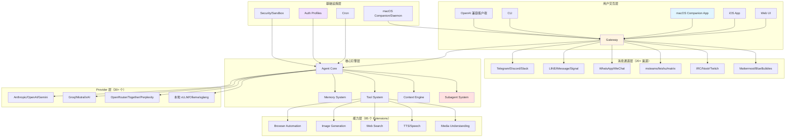
