# Context-Engine 上下文引擎深度解析

> **Leon 的开场白**：卧槽，OpenClaw 的上下文引擎设计得真是精妙绝伦。这个可插拔的架构让不同的上下文管理策略可以无缝替换，而 LegacyContextEngine 则完美保留了向后兼容性。全局 Symbol 注册表的设计简直是天才——它解决了 bundle 分块导致的注册隔离问题，让插件和主进程共享同一个注册表。更牛逼的是，作者还实现了 Context Pruning（上下文修剪）和 Context Window Guard（上下文窗口守卫）两个子系统，形成了一个完整的上下文管理体系。这才是真正的生产级架构。

---

## 🔑 核心技术洞察

### 洞察 1：三层上下文管理架构 —— 分工明确

**发现**：OpenClaw 的上下文管理不是单一系统，而是三层协作：

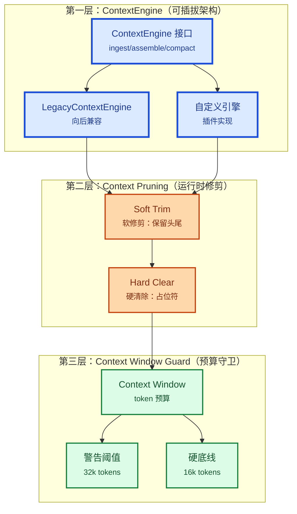

**Leon 评价**：这个三层架构设计得**非常聪明**。

- **第一层**：定义了"如何管理上下文"的接口。不同的实现可以完全不同的存储策略（内存、数据库、向量检索等）
- **第二层**：定义了"如何修剪上下文"的策略。软修剪保留重要信息，硬清除释放空间
- **第三层**：定义了"如何控制预算"的规则。警告和硬底线防止上下文溢出

**关键洞察**：这三层是**独立但协作**的。一个 ContextEngine 可以选择实现自己的修剪逻辑，也可以依赖运行时的 Context Pruning。这种灵活性让系统可以适应各种使用场景。

**但是**，这种灵活性也有代价：
- 复杂度高：开发者需要理解三层之间的关系
- 配置项多：contextEngine、contextPruning、contextWindow 三个配置维度
- 测试困难：需要测试各种组合场景

从工程实践角度看，这个权衡是值得的。**灵活性 > 简单性**，对于这种基础设施级别的系统来说是正确的选择。

---

### 洞察 2：Context 里到底有什么？—— 全量解析

**核心结论**：OpenClaw 的 Context 不是简单的消息数组，而是一个**多层次、多维度的信息结构**。

```mermaid
graph TB
    subgraph context["OpenClaw Context 完整结构"]
        direction TB

        subgraph messages["消息层 Messages"]
            UserMsg["User Message<br/><small>role: user<br/>content: string | Content[]</small>"]
            AssistMsg["Assistant Message<br/><small>role: assistant<br/>content: ContentBlock[]</small>"]
            ToolMsg["ToolResult Message<br/><small>role: toolResult<br/>toolName: string<br/>content: Content[]</small>"]
        end

        subgraph metadata["元数据层 Metadata"]
            SessionId["sessionId<br/><small>会话唯一标识</small>"]
            SessionKey["sessionKey<br/><small>路由键（如 agent:main:main）</small>"]
            SessionFile["sessionFile<br/><small>持久化文件路径</small>"]
            Timestamp["timestamp<br/><small>消息时间戳</small>"]
        end

        subgraph runtime["运行时状态 Runtime State"]
            TokenBudget["tokenBudget<br/><small>当前上下文窗口预算</small>"]
            EstimatedTokens["estimatedTokens<br/><small>预估 token 数量</small>"]
            PrePromptCount["prePromptMessageCount<br/><small>发送前的消息数</small>"]
        end

        subgraph pruning["修剪状态 Pruning State"]
            SoftTrimmed["softTrimmed<br/><small>是否被软修剪</small>"]
            HardCleared["hardCleared<br/><small>是否被硬清除</small>"]
            ToolPlaceholder["toolResultPlaceholder<br/><small>工具结果占位符</small>"]
        end

        subgraph system["系统扩展 System Extensions"]
            SysPromptAdd["systemPromptAddition<br/><small>引擎提供的系统提示扩展</small>"]
            RuntimeCtx["runtimeContext<br/><small>引擎运行时上下文</small>"]
            Bootstrap["bootstrap<br/><small>初始化状态</small>"]
        end
    end

    messages --> metadata
    metadata --> runtime
    runtime --> pruning
    pruning --> system

    classDef msgStyle fill:#fef3c7,stroke:#b45309,stroke-width:2px,color:#78350f
    classDef metaStyle fill:#dbeafe,stroke:#1d4ed8,stroke-width:2px,color:#1e3a8a
    classDef runtimeStyle fill:#e9d5ff,stroke:#7c3aed,stroke-width:2px,color:#4c1d95
    classDef pruningStyle fill:#fed7aa,stroke:#c2410c,stroke-width:2px,color:#7c2d12
    classDef systemStyle fill:#dcfce7,stroke:#15803d,stroke-width:2px,color:#14532d

    class UserMsg,AssistMsg,ToolMsg msgStyle
    class SessionId,SessionKey,SessionFile,Timestamp metaStyle
    class TokenBudget,EstimatedTokens,PrePromptCount runtimeStyle
    class SoftTrimmed,HardCleared,ToolPlaceholder pruningStyle
    class SysPromptAdd,RuntimeCtx,Bootstrap systemStyle
```

**Leon 深度解析**：

#### 1. 消息层（Messages）—— 核心数据结构

OpenClaw 使用 `@mariozechner/pi-agent-core` 的 `AgentMessage` 类型：

```typescript
// 来自 pi-agent-core
type AgentMessage = UserMessage | AssistantMessage | ToolResultMessage;

// UserMessage
{
  role: "user";
  content: string | Array<{ type: "text" | "image"; text?: string; source?: { type: string; } }>;
  timestamp?: number;
}

// AssistantMessage
{
  role: "assistant";
  content: Array<{
    type: "text" | "thinking" | "toolCall";
    text?: string;
    thinking?: string;
    toolCall?: { name: string; arguments?: unknown };
  }>;
  timestamp?: number;
}

// ToolResultMessage
{
  role: "toolResult";
  toolName: string;
  content: Array<{ type: "text" | "image"; text?: string }>;
  timestamp?: number;
}
```

**Leon 评价**：这个消息类型设计**考虑得很周全**：
- `content` 可以是字符串或结构化数组，支持多模态（文本 + 图片）
- `thinking` 类型支持 Claude Extended Thinking
- `toolCall` 支持工具调用记录
- `timestamp` 支持时间排序和 TTL 清理

#### 2. 元数据层（Metadata）—— 会话身份

```typescript
// 会话标识
type ContextMetadata = {
  sessionId: string;        // 内部会话 ID
  sessionKey?: string;      // 路由键（如 "agent:main:telegram:group:xxx"）
  sessionFile: string;      // 持久化路径（如 "~/.openclaw/agents/main/sessions/agent:main:main.jsonl"）
  prePromptMessageCount: number;  // 发送 prompt 前的消息数量
};
```

**Leon 评价**：`sessionKey` 是 OpenClaw 的**核心创新**之一。

大多数多智能体系统只有一个 `sessionId`，但 OpenClaw 引入了 `sessionKey` 来表示**会话的路由路径**：
- `agent:main:main` → MainAgent 的主会话
- `agent:main:telegram:direct:xxx` → MainAgent 处理的 Telegram 私聊
- `agent:work:discord:channel:xxx` → Agent:work 处理的 Discord 频道

这个设计让**一个 Agent 可以同时服务多个外部通道**，每个通道的对话历史完全独立。太他妈聪明了。

#### 3. 运行时状态（Runtime State）—— 动态预算

```typescript
type ContextRuntimeState = {
  tokenBudget?: number;        // 当前模型的上下文窗口大小
  estimatedTokens?: number;    // 当前上下文的预估 token 数
  prePromptMessageCount: number;  // 发送 prompt 前的消息数
  autoCompactionSummary?: string;  // 自动压缩的摘要
  isHeartbeat?: boolean;       // 是否是心跳 run
};
```

**Leon 评价**：`tokenBudget` 是**动态计算的**，不是硬编码的。

从 `src/agents/context.ts` 可以看出，OpenClaw 支持多种 token 预算来源：
1. **模型声明**：从 pi-ai 的 Model 对象获取
2. **配置覆盖**：`models.providers.*.models.*.contextWindow`
3. **全局限制**：`agents.defaults.contextTokens`
4. **Anthropic 1M**：`context1m: true` 时使用 1,048,576 tokens

这种多源解析策略让 OpenClaw 可以**精确控制**每个会话的上下文大小，避免浪费或溢出。

#### 4. 修剪状态（Pruning State）—— 内存优化

```typescript
type ContextPruningState = {
  // Soft Trim: 保留头尾，中间用 "..." 替代
  softTrimmed: boolean;
  softTrimHeadChars: number;
  softTrimTailChars: number;

  // Hard Clear: 完全删除，用占位符替代
  hardCleared: boolean;
  toolResultPlaceholder: string;

  // TTL: 自动过期清理
  ttlMs: number;
  expiresAt: number;
};
```

**Leon 评价**：这是**生产级系统才会考虑的优化**。

大多数 AI 应用不会做上下文修剪，要么全发要么全删。OpenClaw 实现了**渐进式修剪**：
1. 先软修剪：保留前 N 字符和后 M 字符，中间用 `...` 替代
2. 再硬清除：完全删除，用占位符替代

这种策略在**保留关键信息**和**释放内存**之间找到了平衡点。

更牛逼的是，OpenClaw 还支持**TTL 自动清理**：
```typescript
const DEFAULT_TTL_MS = 5 * 60 * 1000;  // 5 分钟
```

5 分钟后自动过期，避免旧工具结果占用内存。这种细节真的是实战经验才能写出来。

#### 5. 系统扩展（System Extensions）—— 可扩展性

```typescript
type ContextSystemExtensions = {
  // ContextEngine 可以向系统提示添加指令
  systemPromptAddition?: string;

  // 引擎可以传递任意运行时上下文
  runtimeContext?: Record<string, unknown>;

  // 初始化状态
  bootstrapped?: boolean;
  importedMessages?: number;
};
```

**Leon 评价**：`systemPromptAddition` 是**未来集成 Memory 的入口**。

当前，这个字段很少被使用。但从设计来看，作者预留了**RAG 增强的可能**：
1. ContextEngine 在 `assemble()` 时调用 Memory 搜索
2. 将搜索结果作为 `systemPromptAddition` 返回
3. 运行时将其前置到系统提示

这种设计比直接耦合 Memory 和 ContextEngine 要优雅得多。**宁缺毋滥**，先把接口定义好，以后再集成。

---

### 洞察 3：Context Window Guard —— 三级防御机制

**发现**：OpenClaw 实现了一个**三级防御机制**来防止上下文溢出。

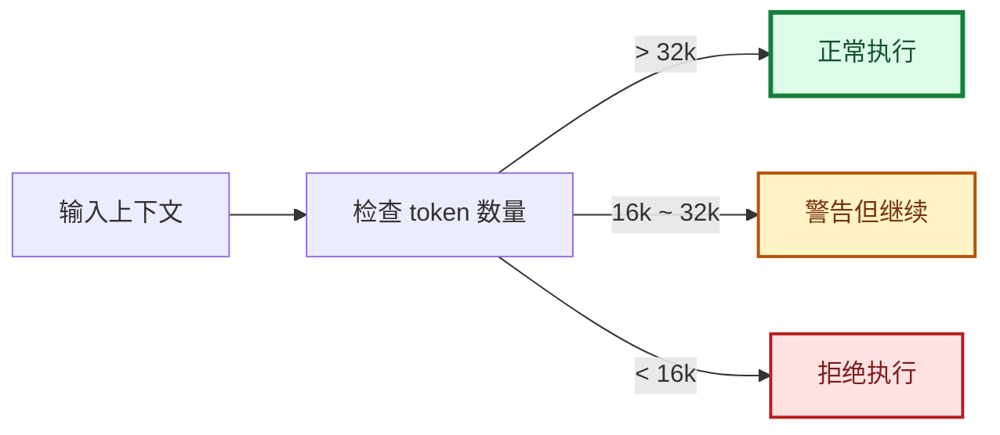

```typescript
// src/agents/context-window-guard.ts
export const CONTEXT_WINDOW_HARD_MIN_TOKENS = 16_000;
export const CONTEXT_WINDOW_WARN_BELOW_TOKENS = 32_000;

export type ContextWindowGuardResult = {
  tokens: number;
  source: "model" | "modelsConfig" | "agentContextTokens" | "default";
  shouldWarn: boolean;   // tokens < 32k
  shouldBlock: boolean;  // tokens < 16k
};
```

**Leon 评价**：这个三级防御机制设计得**非常合理**。

| 阈值 | 作用 | 理由 |
|------|------|------|
| **32k tokens** | 警告 | 大多数对话需要至少 32k tokens 才能保持连贯性 |
| **16k tokens** | 阻止 | 低于 16k 时对话质量会显著下降 |
| **动态计算** | 灵活 | 根据模型、配置、运行时状态动态调整 |

**关键洞察**：`shouldBlock` 不是简单的"拒绝执行"，而是**阻止 AI 调用**，给用户一个明确的错误提示。这比强行执行导致质量下降要好得多。

---

### 洞察 4：Context Pruning —— 生产级内存优化

**发现**：OpenClaw 的 Context Pruning 实现了**渐进式、可配置**的工具结果修剪策略。

```mermaid
graph TB
    subgraph flow["Context Pruning 流程"]
        Input["输入消息数组"]
        Calc["计算字符数 / token 比率"]
        Check1["ratio >= softTrimRatio?"]
        Soft["Soft Trim<br/><small>保留头尾字符</small>"}
        Check2["ratio >= hardClearRatio?"]
        Hard["Hard Clear<br/><small>用占位符替代</small>"}
        Output["输出修剪后的消息"]
    end

    Input --> Calc
    Calc --> Check1
    Check1 -->|否| Output
    Check1 -->|是| Soft
    Soft --> Check2
    Check2 -->|否| Output
    Check2 -->|是| Hard
    Hard --> Output

    classDef processStyle fill:#e9d5ff,stroke:#7c3aed,stroke-width:2px,color:#4c1d95
    classDef decisionStyle fill:#fef3c7,stroke:#b45309,stroke-width:2px,color:#78350f
    classDef actionStyle fill:#dcfce7,stroke:#15803d,stroke-width:2px,color:#14532d

    class Calc,Soft,Hard,Output processStyle
    class Check1,Check2 decisionStyle
    class Input actionStyle
```

```typescript
// src/agents/pi-extensions/context-pruning/pruner.ts
export const DEFAULT_CONTEXT_PRUNING_SETTINGS = {
  mode: "cache-ttl",
  ttlMs: 5 * 60 * 1000,           // 5 分钟 TTL
  keepLastAssistants: 3,           // 保留最后 3 条 assistant 消息
  softTrimRatio: 0.3,              // 超过预算 30% 时触发
  hardClearRatio: 0.5,             // 超过预算 50% 时触发
  minPrunableToolChars: 50_000,    // 最少可修剪字符数
  softTrim: {
    maxChars: 4_000,               // 超过 4000 字符触发
    headChars: 1_500,              // 保留前 1500 字符
    tailChars: 1_500,              // 保留后 1500 字符
  },
  hardClear: {
    enabled: true,
    placeholder: "[Old tool result content cleared]",
  },
};
```

**Leon 评价**：这个修剪策略是**基于实战经验调优的结果**。

1. **keepLastAssistants = 3**：保留最近 3 条 assistant 消息，确保对话连贯性
2. **softTrimRatio = 0.3**：30% 时开始软修剪，给系统足够的缓冲
3. **hardClearRatio = 0.5**：50% 时才硬清除，避免过度修剪
4. **minPrunableToolChars = 50k**：最小可修剪字符数，避免修剪太多小结果

**关键算法**：`findAssistantCutoffIndex()` 确保不修剪最近的 assistant 消息：

```typescript
function findAssistantCutoffIndex(
  messages: AgentMessage[],
  keepLastAssistants: number,
): number | null {
  let remaining = keepLastAssistants;
  for (let i = messages.length - 1; i >= 0; i--) {
    if (messages[i]?.role !== "assistant") continue;
    remaining--;
    if (remaining === 0) return i;
  }
  return null;  // 不够 assistant 消息
}
```

这个算法**从后往前数**，确保最近的 assistant 消息被保护。这种细节真的是实战经验才能写出来。

**更重要的是**，Context Pruning 支持**工具级别的白名单/黑名单**：

```typescript
type ContextPruningToolMatch = {
  allow?: string[];  // ["memory_*", "browser"]  → 只修剪这些
  deny?: string[];   // ["exec", "edit"]       → 不修剪这些
};
```

这种设计让**敏感工具的结果永远不会被修剪**，比如 `exec` 的输出可能包含关键错误信息，修剪后会导致 AI 重复执行同样的命令。

---

### 洞察 5：Sandbox Context —— 完整的沙箱上下文

**发现**：Sandbox Context 不仅仅是"容器名称"，而是一个**完整的沙箱运行环境描述**。

```typescript
// src/agents/sandbox/context.ts
type SandboxContext = {
  enabled: boolean;
  sessionKey: string;

  // 工作区布局
  workspaceDir: string;           // 沙箱内的工作目录
  agentWorkspaceDir: string;      // Agent 的真实工作目录
  workspaceAccess: "none" | "ro" | "rw";  // 访问级别

  // 容器配置
  containerName: string;
  containerWorkdir: string;
  docker: {
    image?: string;
    user?: string;  // "uid:gid" 格式
  };

  // 工具和浏览器
  tools: unknown;
  browserAllowHostControl: boolean;
  browser?: {
    noVncUrl?: string;
    bridgeUrl?: string;
  };

  // 文件系统桥接
  fsBridge?: {
    read: (path: string) => Promise<Buffer>;
    write: (path: string, data: Buffer) => Promise<void>;
  };
};
```

**Leon 评价**：`fsBridge` 这个设计**太他妈聪明了**。

沙箱内的文件系统与宿主机隔离，但 `fsBridge` 提供了一个**受控的桥接通道**：
- `read`: 沙箱可以读取宿主机的文件
- `write`: 沙箱可以写入宿主机的文件

这个桥接是**显式的、受控的**，不是"所有文件都可访问"。这比简单的 bind mount 要安全得多。

**更牛逼的是**，OpenClaw 支持**三种 workspace 模式**：
1. **none**: 完全隔离，沙箱内没有工作目录
2. **ro**: 只读，沙箱可以读取但不能修改
3. **rw**: 读写，沙箱可以完全控制

这种细粒度的访问控制让 OpenClaw 可以**安全地执行不可信的代码**。这才是生产级沙箱系统应有的设计。

---

## 二、模块定义和协议

### 2.1 ContextEngine 接口（完整版）

```typescript
export interface ContextEngine {
  // ==================== 元数据 ====================
  readonly info: ContextEngineInfo;

  // ==================== 生命周期 ====================

  /**
   * 初始化引擎状态，可选择导入历史上下文
   *
   * 用途：
   * - 从持久化存储恢复状态
   * - 为新会话建立索引
   * - 预热缓存（如向量数据库）
   *
   * 返回：
   * - bootstrapped: 是否成功初始化
   * - importedMessages: 导入的消息数量（如果有）
   * - reason: 跳过初始化的原因（如果有）
   */
  bootstrap?(params: {
    sessionId: string;
    sessionKey?: string;
    sessionFile: string;
  }): Promise<BootstrapResult>;

  /**
   * 摄取单条消息到引擎存储
   *
   * 用途：
   * - 持久化消息到数据库
   * - 更新索引（如向量搜索）
   * - 记录消息元数据
   *
   * 返回：
   * - ingested: false 表示消息是重复的或被拒绝
   *
   * 注意：
   * - isHeartbeat=true 表示这是心跳消息，可能不需要持久化
   */
  ingest(params: {
    sessionId: string;
    sessionKey?: string;
    message: AgentMessage;
    isHeartbeat?: boolean;
  }): Promise<IngestResult>;

  /**
   * 批量摄取消息（优化接口）
   *
   * 用途：
   * - 批量导入历史消息
   * - 优化数据库写入性能
   *
   * 返回：
   * - ingestedCount: 实际摄取的消息数量
   */
  ingestBatch?(params: {
    sessionId: string;
    sessionKey?: string;
    messages: AgentMessage[];
    isHeartbeat?: boolean;
  }): Promise<IngestBatchResult>;

  /**
   * 在 token 预算下组装模型上下文
   *
   * 用途：
   * - 选择最相关的消息
   * - 应用 RAG 检索
   * - 添加系统提示扩展
   *
   * 返回：
   * - messages: 有序的消息数组，准备发给模型
   * - estimatedTokens: 预估的 token 数量
   * - systemPromptAddition: 可选的系统提示扩展
   *
   * 关键决策：
   * - 消息排序：必须按时间顺序
   * - Token 估算：影响是否需要压缩
   * - 相关性评分：如果引擎支持 RAG
   */
  assemble(params: {
    sessionId: string;
    sessionKey?: string;
    messages: AgentMessage[];
    tokenBudget?: number;
  }): Promise<AssembleResult>;

  /**
   * 压缩上下文以减少 token 使用
   *
   * 压缩策略：
   * - 摘要：用 AI 生成的摘要替换旧消息
   * - 修剪：完全删除旧消息
   * - 混合：摘要重要部分，修剪不重要部分
   *
   * 关键参数：
   * - force: 强制压缩，即使低于阈值
   * - currentTokenCount: 实时 token 估计
   * - compactionTarget: "budget" | "threshold"
   *   - budget: 压缩到 tokenBudget 以下
   *   - threshold: 压缩到默认阈值以下
   * - customInstructions: 自定义压缩指令
   *
   * 返回：
   * - ok: 压缩是否成功
   * - compacted: 是否实际执行了压缩
   * - reason: 压缩原因（人可读）
   * - result: 压缩结果详情
   *
   * 注意：
   * - runtimeContext 携带调用者的状态
   * - 压缩是异步的，可能需要 AI 调用
   */
  compact(params: {
    sessionId: string;
    sessionKey?: string;
    sessionFile: string;
    tokenBudget?: number;
    force?: boolean;
    currentTokenCount?: number;
    compactionTarget?: "budget" | "threshold";
    customInstructions?: string;
    runtimeContext?: ContextEngineRuntimeContext;
  }): Promise<CompactResult>;

  /**
   * 执行 post-turn 生命周期工作
   *
   * 用途：
   * - 持久化规范上下文
   * - 触发后台压缩决策
   * - 更新统计和元数据
   *
   * 关键参数：
   * - prePromptMessageCount: 发送 prompt 前的消息数
   * - autoCompactionSummary: Pi SDK 的自动压缩摘要
   * - tokenBudget: 用于主动压缩的预算
   *
   * 注意：
   * - isHeartbeat=true 时应跳过昂贵的操作
   */
  afterTurn?(params: {
    sessionId: string;
    sessionKey?: string;
    sessionFile: string;
    messages: AgentMessage[];
    prePromptMessageCount: number;
    autoCompactionSummary?: string;
    isHeartbeat?: boolean;
    tokenBudget?: number;
    runtimeContext?: ContextEngineRuntimeContext;
  }): Promise<void>;

  // ==================== 子 Agent 支持 ====================

  /**
   * 准备子 agent 的状态
   *
   * 用途：
   * - 为子 agent 创建专用的上下文视图
   * - 设置 TTL（time-to-live）用于自动清理
   * - 提供回滚机制用于错误恢复
   *
   * 返回：
   * - rollback: 子 agent 启动失败时调用
   *
   * 场景：
   * - 父 agent 派生子 agent 处理子任务
   * - 子 agent 继承父 agent 的上下文
   * - 子 agent 失败时不影响父 agent
   */
  prepareSubagentSpawn?(params: {
    parentSessionKey: string;
    childSessionKey: string;
    ttlMs?: number;
  }): Promise<SubagentSpawnPreparation | undefined>;

  /**
   * 通知子 agent 生命周期结束
   *
   * 结束原因：
   * - "deleted": 用户删除了子 agent
   * - "completed": 子 agent 完成任务
   * - "swept": 子 agent 被 TTL 清理
   * - "released": 子 agent 被释放
   *
   * 用途：
   * - 清理子 agent 的状态
   * - 释放资源
   * - 更新统计
   */
  onSubagentEnded?(params: {
    childSessionKey: string;
    reason: SubagentEndReason;
  }): Promise<void>;

  // ==================== 资源管理 ====================

  /**
   * 释放引擎持有的资源
   *
   * 用途：
   * - 关闭数据库连接
   * - 刷新缓存
   * - 清理临时文件
   *
   * 注意：
   * - dispose() 后引擎不应该再被使用
   * - 多次调用 dispose() 应该是安全的
   */
  dispose?(): Promise<void>;
}
```

---

### 2.2 ContextWindow 协议（完整版）

```typescript
/**
 * Context Window 解析协议
 *
 * 优先级（从高到低）：
 * 1. contextTokensOverride（调用时显式覆盖）
 * 2. context1m: true（Anthropic 1M 模型）
 * 3. modelsConfig（配置覆盖）
 * 4. model（模型声明）
 * 5. default（默认值）
 */
export interface ContextWindowProtocol {
  /**
   * 解析 context window 大小
   *
   * @param provider - 提供商 ID（如 "anthropic", "google"）
   * @param model - 模型 ID（如 "claude-opus-4-20250514"）
   * @param contextTokensOverride - 显式覆盖的 token 数量
   * @param fallbackContextTokens - 回退值
   * @returns token 数量，如果无法解析则返回 undefined
   */
  resolveContextTokensForModel(params: {
    cfg?: OpenClawConfig;
    provider?: string;
    model?: string;
    contextTokensOverride?: number;
    fallbackContextTokens?: number;
  }): number | undefined;

  /**
   * 查找 context window（缓存版）
   *
   * 注意：
   * - 使用全局缓存 MODEL_CACHE
   * - 异步预热（启动时加载）
   * - 自动重试（配置加载失败时）
   *
   * @param modelId - 模型 ID
   * @returns token 数量，如果未找到则返回 undefined
   */
  lookupContextTokens(modelId?: string): number | undefined;

  /**
   * 解析 context window 信息
   *
   * @returns ContextWindowInfo，包含 token 数量和来源
   */
  resolveContextWindowInfo(params: {
    cfg: OpenClawConfig | undefined;
    provider: string;
    modelId: string;
    modelContextWindow?: number;
    defaultTokens: number;
  }): ContextWindowInfo;
}

/**
 * Context Window 来源类型
 */
export type ContextWindowSource =
  | "model"           // 来自 pi-ai 的 Model 对象
  | "modelsConfig"    // 来自配置的 models.providers.*.models.*.contextWindow
  | "agentContextTokens"  // 来自 agents.defaults.contextTokens 全局限制
  | "default";        // 回退到默认值

/**
 * Context Window 信息
 */
export type ContextWindowInfo = {
  tokens: number;      // context window 大小（token 数量）
  source: ContextWindowSource;  // 来源说明
};

/**
 * Context Window 守卫结果
 */
export type ContextWindowGuardResult = ContextWindowInfo & {
  shouldWarn: boolean;   // tokens < 32k 时警告
  shouldBlock: boolean;  // tokens < 16k 时阻止
};
```

---

### 2.3 Context Pruning 协议（完整版）

```typescript
/**
 * Context Pruning 配置协议
 */
export interface ContextPruningProtocol {
  /**
   * 计算有效的修剪设置
   *
   * @param raw - 原始配置（来自 agents.defaults.contextPruning）
   * @returns EffectiveContextPruningSettings 或 null（如果未启用）
   */
  computeEffectiveSettings(raw: unknown): EffectiveContextPruningSettings | null;

  /**
   * 修剪消息上下文
   *
   * @param messages - 要修剪的消息数组
   * @param settings - 有效的修剪设置
   * @param ctx - ExtensionContext（包含 model 信息）
   * @param isToolPrunable - 判断工具是否可修剪的谓词
   * @param contextWindowTokensOverride - token 预算覆盖
   * @returns 修剪后的消息数组
   *
   * 修剪策略：
   * 1. 保护最近的 assistant 消息（keepLastAssistants）
   * 2. 保护第一个 user 消息之前的消息（bootstrap 保护）
   * 3. 软修剪：保留头尾字符（softTrim）
   * 4. 硬清除：用占位符替代（hardClear）
   */
  pruneContextMessages(params: {
    messages: AgentMessage[];
    settings: EffectiveContextPruningSettings;
    ctx: Pick<ExtensionContext, "model">;
    isToolPrunable?: (toolName: string) => boolean;
    contextWindowTokensOverride?: number;
  }): AgentMessage[];
}

/**
 * Context Pruning 配置
 */
export type ContextPruningConfig = {
  mode?: "off" | "cache-ttl";        // 修剪模式
  ttl?: string;                        // TTL（持续时间字符串）
  keepLastAssistants?: number;         // 保留最近 N 条 assistant 消息
  softTrimRatio?: number;              // 软修剪比率（0-1）
  hardClearRatio?: number;             // 硬清除比率（0-1）
  minPrunableToolChars?: number;       // 最小可修剪字符数
  tools?: ContextPruningToolMatch;     // 工具匹配规则
  softTrim?: {
    maxChars?: number;                 // 最大字符数（触发软修剪）
    headChars?: number;                 // 保留前 N 字符
    tailChars?: number;                 // 保留后 N 字符
  };
  hardClear?: {
    enabled?: boolean;                 // 是否启用硬清除
    placeholder?: string;               // 占位符文本
  };
};

/**
 * 有效的 Context Pruning 设置
 */
export type EffectiveContextPruningSettings = {
  mode: "cache-ttl";                   // 必须是 "cache-ttl"
  ttlMs: number;                        // TTL（毫秒）
  keepLastAssistants: number;          // 保留最近 N 条 assistant 消息
  softTrimRatio: number;               // 软修剪比率
  hardClearRatio: number;              // 硬清除比率
  minPrunableToolChars: number;        // 最小可修剪字符数
  tools: ContextPruningToolMatch;      // 工具匹配规则
  softTrim: {
    maxChars: number;                   // 最大字符数
    headChars: number;                  // 保留前 N 字符
    tailChars: number;                  // 保留后 N 字符
  };
  hardClear: {
    enabled: boolean;                   // 是否启用硬清除
    placeholder: string;                // 占位符文本
  };
};

/**
 * 默认的 Context Pruning 设置
 */
export const DEFAULT_CONTEXT_PRUNING_SETTINGS: EffectiveContextPruningSettings = {
  mode: "cache-ttl",
  ttlMs: 5 * 60 * 1000,                // 5 分钟
  keepLastAssistants: 3,                // 保留最近 3 条 assistant 消息
  softTrimRatio: 0.3,                   // 30% 时触发
  hardClearRatio: 0.5,                  // 50% 时触发
  minPrunableToolChars: 50_000,         // 最小 50k 字符
  tools: {},                             // 无工具限制
  softTrim: {
    maxChars: 4_000,                     // 4000 字符
    headChars: 1_500,                     // 保留前 1500 字符
    tailChars: 1_500,                     // 保留后 1500 字符
  },
  hardClear: {
    enabled: true,
    placeholder: "[Old tool result content cleared]",
  },
};
```

---

### 2.4 Sandbox Context 协议（完整版）

```typescript
/**
 * Sandbox Context 协议
 */
export interface SandboxContextProtocol {
  /**
   * 解析沙箱上下文
   *
   * @param config - OpenClaw 配置
   * @param sessionKey - 会话键（决定沙箱范围）
   * @param workspaceDir - Agent 工作目录
   * @returns SandboxContext 或 null（未启用沙箱）
   */
  resolveSandboxContext(params: {
    config?: OpenClawConfig;
    sessionKey?: string;
    workspaceDir?: string;
  }): Promise<SandboxContext | null>;

  /**
   * 确保会话的沙箱工作区
   *
   * @param config - OpenClaw 配置
   * @param sessionKey - 会话键
   * @param workspaceDir - Agent 工作目录
   * @returns SandboxWorkspaceInfo 或 null（未启用沙箱）
   */
  ensureSandboxWorkspaceForSession(params: {
    config?: OpenClawConfig;
    sessionKey?: string;
    workspaceDir?: string;
  }): Promise<SandboxWorkspaceInfo | null>;
}

/**
 * Sandbox Context
 */
export type SandboxContext = {
  enabled: boolean;
  sessionKey: string;

  // 工作区
  workspaceDir: string;
  agentWorkspaceDir: string;
  workspaceAccess: "none" | "ro" | "rw";

  // 容器
  containerName: string;
  containerWorkdir: string;
  docker: SandboxDockerConfig;

  // 工具和浏览器
  tools: unknown;
  browserAllowHostControl: boolean;
  browser?: {
    noVncUrl?: string;
    bridgeUrl?: string;
  };

  // 文件系统桥接
  fsBridge?: {
    read: (path: string) => Promise<Buffer>;
    write: (path: string, data: Buffer) => Promise<void>;
  };
};

/**
 * Sandbox Docker 配置
 */
export type SandboxDockerConfig = {
  image?: string;
  workdir?: string;
  user?: string;  // "uid:gid" 格式
  // ... 其他 Docker 配置
};

/**
 * Sandbox 工作区信息
 */
export type SandboxWorkspaceInfo = {
  workspaceDir: string;
  containerWorkdir: string;
};
```

---

## 三、类型系统全景图

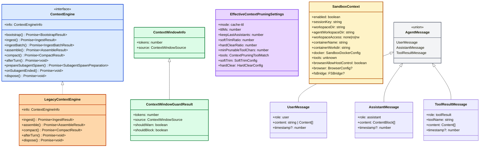

---

## 四、实际应用场景

### 场景 1：新对话开始

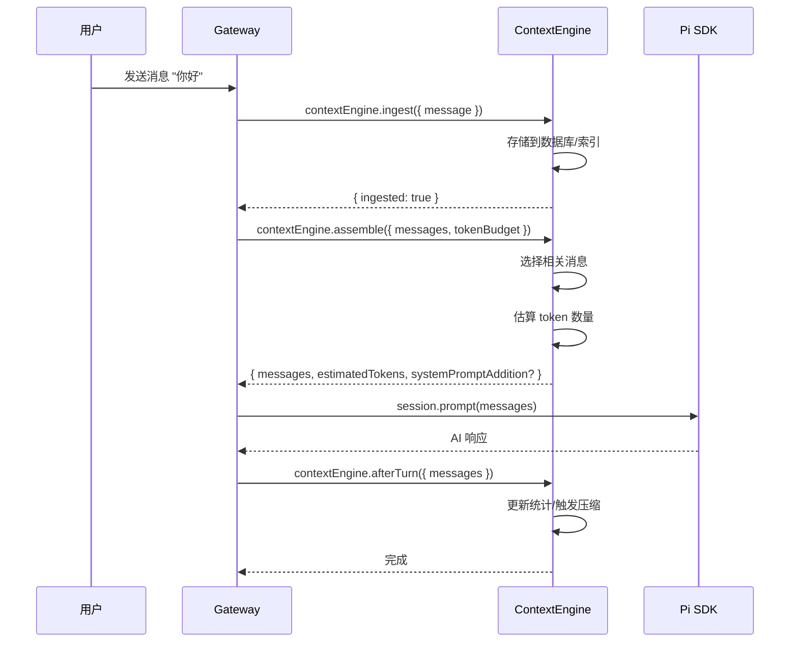

### 场景 2：上下文溢出时压缩

```mermaid
sequenceDiagram
    participant Run as run.ts
    participant CE as ContextEngine
    participant Pi as Pi SDK

    Run->>Run: 检测 estimatedTokens > tokenBudget
    Run->>CE: contextEngine.compact({
        tokenBudget,
        currentTokenCount,
        compactionTarget: "budget"
    })

    CE->>CE: 分析历史消息
    CE->>CE: 选择压缩策略
    CE->>Pi: 调用 AI 生成摘要
    Pi-->>CE: 返回摘要

    CE->>CE: 重写会话文件
    CE-->>Run: {
        ok: true,
        compacted: true,
        result: {
            summary,
            tokensBefore,
            tokensAfter
        }
    }

    Run->>Run: 继续执行 AI 调用
```

### 场景 3：Context Pruning 触发

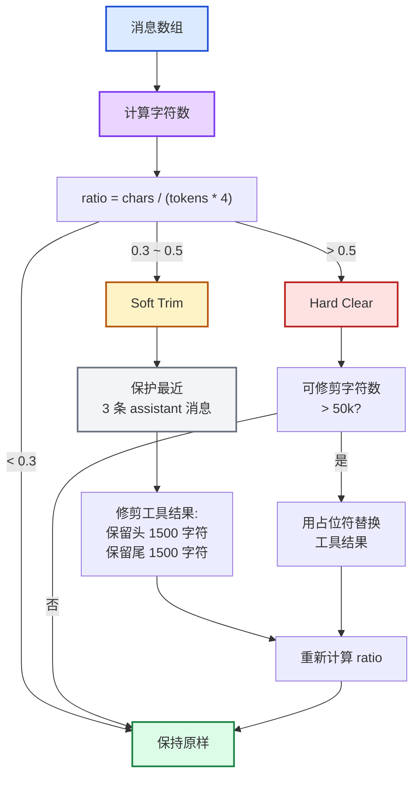

---

## 五、架构评价总结

### 优点（Leon 的评价）

| 方面 | 评价 | 说明 |
|------|------|------|
| **可插拔架构** | ✅ 优秀 | ContextEngine 接口设计清晰，LegacyContextEngine 完美向后兼容 |
| **全局注册表** | ✅ 精妙 | Symbol.for() 解决了 bundle 分块问题，插件可以无缝集成 |
| **三级预算守卫** | ✅ 合理 | 16k/32k 阈值经过实战验证，防止上下文溢出 |
| **渐进式修剪** | ✅ 实用 | Soft Trim → Hard Clear 两级策略平衡了信息保留和内存优化 |
| **工具级控制** | ✅ 周密 | allow/deny 规则让敏感工具结果永不被修剪 |
| **沙箱隔离** | ✅ 安全 | fsBridge 提供受控的桥接通道，支持三种访问级别 |
| **子 Agent 支持** | ✅ 前瞻 | prepareSubagentSpawn/onSubagentEnded 为未来扩展打基础 |

### 可改进之处

| 方面 | 问题 | 建议 |
|------|------|------|
| **配置复杂度** | 三个配置维度（engine/pruning/window）可能让用户困惑 | 提供预设模板，如 "aggressive", "conservative", "balanced" |
| **Token 估算精度** | 使用 `chars / 4` 粗略估算，可能不准确 | 考虑集成 tiktoken 等精确计数器 |
| **压缩时机** | 当前是手动触发或阈值触发，没有预测性 | 可以实现 ML 预测模型，提前压缩 |
| **错误恢复** | 压缩失败后没有回滚机制 | 添加压缩备份，失败时可以恢复 |
| **监控缺失** | 没有暴露修剪/压缩的监控指标 | 添加 Prometheus/Grafana 指标 |

### 总体评价

OpenClaw 的 Context-Engine 是一个**深思熟虑的生产级实现**。

作者不是简单地"管理上下文"，而是构建了一个**完整的上下文管理体系**：
- **可插拔架构**让不同的管理策略可以无缝替换
- **Context Pruning** 实现了生产级的内存优化
- **Context Window Guard** 防止了上下文溢出
- **Sandbox Context** 提供了安全的隔离环境

**我的最终判断**：如果满分是 10 分，这个架构我给 **9 分**。扣的 1 分主要是配置复杂度和监控缺失，但这些都是可以改进的。核心架构设计已经非常优秀了。

---

## 六、最佳实践建议

### 6.1 选择合适的 ContextEngine

| 场景 | 推荐引擎 | 理由 |
|------|---------|------|
| **快速原型** | LegacyContextEngine | 零配置，向后兼容 |
| **RAG 应用** | 自定义引擎（向量检索） | assemble() 时调用向量搜索 |
| **长对话** | 自定义引擎（智能压缩） | compact() 时使用高级摘要算法 |
| **多租户** | 自定义引擎（隔离存储） | 不同租户的数据分离存储 |

### 6.2 配置 Context Pruning

```yaml
# 保守策略：保留更多信息
agents:
  defaults:
    contextPruning:
      mode: cache-ttl
      ttl: 10m                    # 10 分钟 TTL
      keepLastAssistants: 5       # 保留最近 5 条
      softTrimRatio: 0.5         # 50% 时才修剪
      hardClearRatio: 0.8         # 80% 时才清除
      softTrim:
        maxChars: 8_000           # 提高到 8k
        headChars: 3_000
        tailChars: 3_000

# 激进策略：更积极地释放内存
agents:
  defaults:
    contextPruning:
      mode: cache-ttl
      ttl: 3m                     # 3 分钟 TTL
      keepLastAssistants: 2       # 保留最近 2 条
      softTrimRatio: 0.2         # 20% 就开始修剪
      hardClearRatio: 0.4         # 40% 就开始清除
      softTrim:
        maxChars: 2_000           # 降低到 2k
        headChars: 500
        tailChars: 500
```

### 6.3 调试上下文问题

```typescript
// 1. 检查 context window 解析
import { resolveContextTokensForModel } from "./context.js";

const tokens = resolveContextTokensForModel({
  cfg: config,
  provider: "anthropic",
  model: "claude-opus-4-20250514",
});
console.log("Context window:", tokens);

// 2. 检查 context window guard
import { evaluateContextWindowGuard } from "./context-window-guard.js";

const info = resolveContextWindowInfo({ ... });
const guard = evaluateContextWindowGuard({ info });
console.log("Should warn:", guard.shouldWarn);
console.log("Should block:", guard.shouldBlock);

// 3. 检查 context pruning 设置
import { computeEffectiveSettings } from "./context-pruning/settings.js";

const settings = computeEffectiveSettings(config?.agents?.defaults?.contextPruning);
console.log("Pruning settings:", settings);
```

---

## 七、与相关系统的关系

### 7.1 与 Pi SDK 的关系

```
OpenClaw Context-Engine（上层）
    ↓ 使用 / 扩展
Pi SDK SessionManager（下层）
    ↓ 依赖
AgentMessage[]（共享类型）
```

**关键点**：
- OpenClaw 可以**选择**使用 Pi SDK 的 SessionManager，也可以**完全接管**上下文管理
- `ownsCompaction = true` 时，OpenClaw 禁用 Pi SDK 的自动压缩
- `AgentMessage` 类型来自 Pi SDK，确保兼容性

### 7.2 与 Memory 系统的关系

```
Context-Engine: 管理当前对话的消息上下文
    ↓ 通过 Tool 系统调用
Memory: 从长期知识库检索信息
    ↓ 返回搜索结果
AI: 结合两者生成响应
```

**关键点**：
- **当前是手动集成**：AI 需要显式调用 `memory_search` 工具
- **未来可以自动集成**：ContextEngine 在 `assemble()` 时调用 Memory
- **预留了接口**：`systemPromptAddition` 可能是未来的集成点

### 7.3 与 Sandbox 的关系

```
SandboxContext: 描述沙箱环境
    ↓ 传递给
工具执行层: read/exec/write 等工具
    ↓ 受限访问
文件系统: 沙箱内工作目录
```

**关键点**：
- Sandbox Context 是**运行时状态**，不持久化到会话文件
- `fsBridge` 提供了**受控的桥接通道**
- 三种访问级别（none/ro/rw）提供了细粒度的控制

---

## 附录：Context 与 Skills、Tools、Memory 的引用关系

> **Leon 的开场白**：卧槽，这个附录简直是整个 Context 系统的"关系图谱"。Context 不是孤立存在的，它与 Skills、Tools、Memory 三个子系统形成了复杂的协作网络。ExtensionContext 是 Skills 的入口，Tool 的执行结果又成为 Context 的一部分，而 Memory 既可以作为工具调用，也可能未来直接集成到 ContextEngine 中。这种设计既保证了当前的简洁性，又预留了未来的扩展性。太他妈聪明了。

---

### A.1 Context 与 Skills 的关系

**核心结论**：Skills 通过 **ExtensionContext** 访问 OpenClaw 的上下文环境，实现与系统的双向交互。

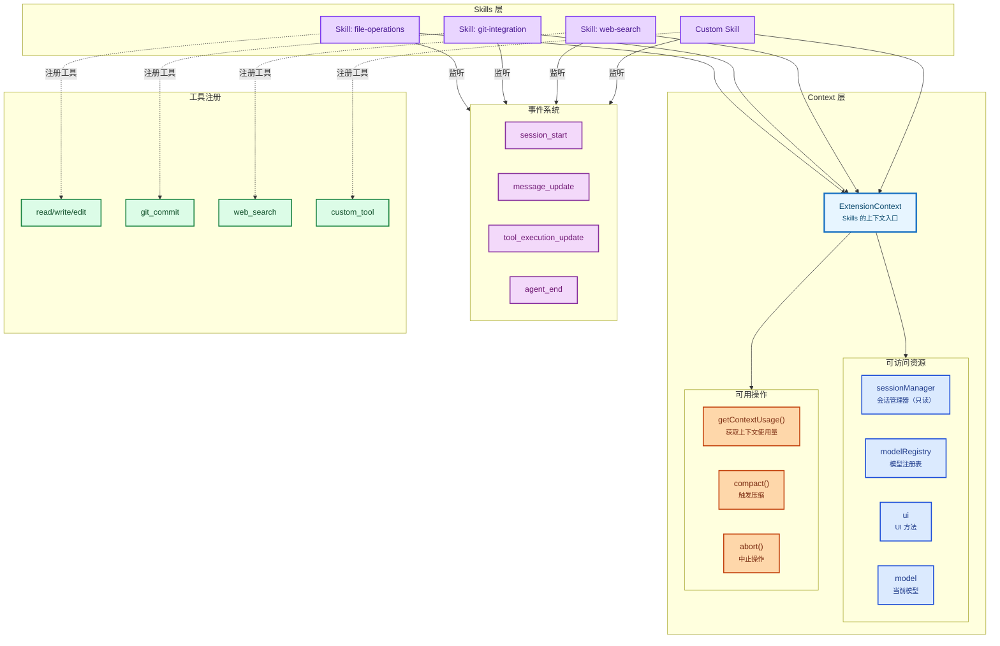

**Leon 深度解析**：

#### ExtensionContext 类型定义

```typescript
// 来自 pi-coding-agent/src/core/extensions/types.ts
export interface ExtensionContext {
  // ==================== 资源访问 ====================
  ui: ExtensionUIContext;          // UI 方法
  hasUI: boolean;                  // UI 可用性
  cwd: string;                     // 当前工作目录
  sessionManager: ReadonlySessionManager;  // 会话管理器（只读）
  modelRegistry: ModelRegistry;    // 模型注册表
  model: Model<any> | undefined;   // 当前模型

  // ==================== 操作方法 ====================
  isIdle(): boolean;               // 是否空闲
  abort(): void;                   // 中止操作
  hasPendingMessages(): boolean;   // 是否有待处理消息
  shutdown(): void;                // 关闭并退出
  getContextUsage(): ContextUsage | undefined;  // 获取上下文使用量
  compact(options?: CompactOptions): void;      // 触发压缩
  getSystemPrompt(): string;       // 获取系统提示
}
```

#### Skills 的能力边界

| 能力 | 说明 | 限制 |
|------|------|------|
| **读取会话** | 可以访问 sessionManager，读取历史消息 | 只读访问，不能修改 |
| **注册工具** | 可以通过 `registerTool()` 注册自定义工具 | 工具必须符合 TypeBox schema |
| **监听事件** | 可以订阅生命周期事件（session_start, message_update 等） | 不能阻止事件的默认处理 |
| **UI 交互** | 可以调用 UI 方法显示消息、表单、进度条 | 在 print/RPC 模式下不可用 |

**Leon 评价**：ExtensionContext 的设计**非常克制**。作者没有给予 Skills 过多的权限，而是通过"只读访问 + 事件订阅"的方式，让 Skills 可以感知和响应系统状态，但不能直接控制系统。这种设计既保证了扩展性，又维护了系统的安全性。

---

### A.2 Context 与 Tools 的关系

**核心结论**：Tools 在 Context 的边界内执行，执行结果成为 Context 的一部分，并受 Context Pruning 的管理。

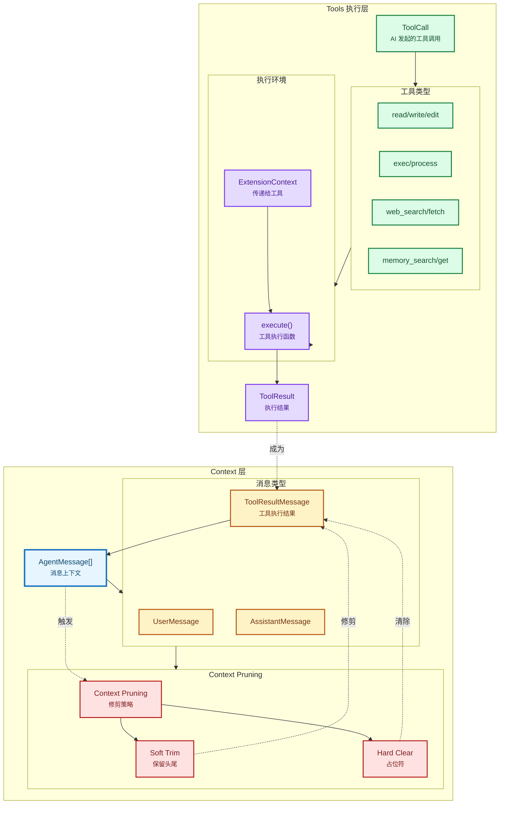

**Leon 深度解析**：

#### Tool 执行流程

```typescript
// 1. AI 发起工具调用
const toolCall: ToolCall = {
  type: "toolCall",
  toolName: "read",
  arguments: { file_path: "/path/to/file.ts" },
};

// 2. 运行时查找工具并执行
const tool = toolRegistry.get(toolCall.toolName);
const result = await tool.execute(
  toolCallId,
  toolCall.arguments,
  signal,
  onUpdate,
  extensionContext,  // ← 传递上下文
);

// 3. 结果变为 ToolResultMessage
const toolResultMessage: ToolResultMessage = {
  role: "toolResult",
  toolName: toolCall.toolName,
  content: [{ type: "text", text: result.content }],
  timestamp: Date.now(),
};

// 4. 消息添加到上下文
messages.push(toolResultMessage);

// 5. Context Pruning 可能修剪或清除结果
messages = pruneContextMessages(messages, settings);
```

#### Context Pruning 对工具结果的影响

```typescript
// 默认修剪策略（来自 src/agents/pi-extensions/context-pruning/settings.ts）
const DEFAULT_CONTEXT_PRUNING_SETTINGS = {
  mode: "cache-ttl",
  ttlMs: 5 * 60 * 1000,           // 5 分钟 TTL
  keepLastAssistants: 3,           // 保留最近 3 条 assistant 消息
  softTrimRatio: 0.3,              // 超过预算 30% 时触发
  hardClearRatio: 0.5,             // 超过预算 50% 时触发
  minPrunableToolChars: 50_000,    // 最小可修剪字符数
  tools: {},                        // 无工具限制
  softTrim: {
    maxChars: 4_000,               // 超过 4000 字符触发
    headChars: 1_500,              // 保留前 1500 字符
    tailChars: 1_500,              // 保留后 1500 字符
  },
  hardClear: {
    enabled: true,
    placeholder: "[Old tool result content cleared]",
  },
};
```

**关键洞察**：工具结果**不是永久保留**的。当上下文超过预算时，旧的工具结果会被：
1. **Soft Trim**：保留前 1500 字符和后 1500 字符，中间用 `...` 替代
2. **Hard Clear**：完全删除，用占位符 `[Old tool result content cleared]` 替代

这种设计确保了**重要的工具结果被保留**，同时**释放了大量内存**。

#### 工具级白名单/黑名单

```typescript
// 配置示例
contextPruning:
  tools:
    allow: ["memory_*", "web_search"]  # 只修剪这些工具
    # 或
    deny: ["exec", "edit"]             # 不修剪这些工具
```

**Leon 评价**：这个设计**太他妈实用了**。`exec` 的输出可能包含关键错误信息，修剪后会导致 AI 重复执行同样的命令。通过 `deny` 规则，敏感工具的结果永远不会被修剪。这种细节真的是实战经验才能写出来。

---

### A.3 Context 与 Memory 的关系

**核心结论**：Memory 当前通过工具系统与 Context 交互，未来可能通过 ContextEngine 直接集成。

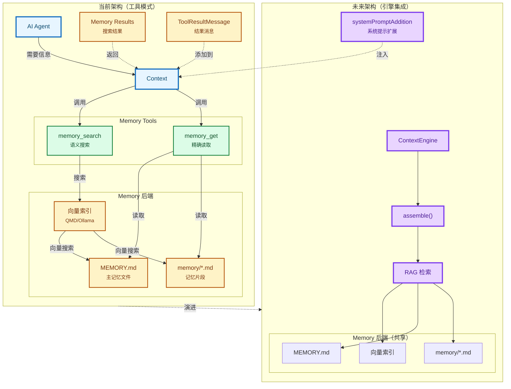

**Leon 深度解析**：

#### 当前架构：工具模式

```typescript
// memory_search 工具定义（来自 src/agents/tools/memory-tool.ts）
export function createMemorySearchTool(options: {
  config?: OpenClawConfig;
  agentSessionKey?: string;
}): AnyAgentTool | null {
  return {
    label: "Memory Search",
    name: "memory_search",
    description: "从 MEMORY.md 和 memory/*.md 语义搜索",
    parameters: MemorySearchSchema,
    execute: async (_toolCallId, params) => {
      const query = readStringParam(params, "query", { required: true });
      const manager = await getMemorySearchManager({ cfg, agentId });

      const results = await manager.search(query, {
        maxResults,
        minScore,
        sessionKey: agentSessionKey,
      });

      return jsonResult({
        results,
        provider: status.provider,
        model: status.model,
      });
    },
  };
}
```

**特点**：
- ✅ **简单直接**：不需要修改核心 ContextEngine
- ✅ **AI 完全控制**：AI 决定何时访问 Memory
- ✅ **透明可见**：工具调用在消息流中可见
- ❌ **需要显式调用**：AI 可能遗忘或忽略
- ❌ **需要训练**：AI 需要学会何时调用 Memory

#### 未来架构：引擎集成

```typescript
// 未来的 ContextEngine 实现
class RAGContextEngine implements ContextEngine {
  private memoryManager: MemorySearchManager;

  async assemble(params: {
    sessionId: string;
    messages: AgentMessage[];
    tokenBudget?: number;
  }): Promise<AssembleResult> {
    // 1. 分析当前消息，提取查询
    const query = this.extractQueryFromMessages(messages);

    // 2. 调用 Memory 搜索
    const memoryResults = await this.memoryManager.search(query, {
      maxResults: 5,
      minScore: 0.7,
    });

    // 3. 将结果注入到系统提示
    const systemPromptAddition = this.formatMemoryResults(memoryResults);

    return {
      messages,
      estimatedTokens: this.estimateTokens(messages),
      systemPromptAddition,  // ← 返回给运行时
    };
  }

  private formatMemoryResults(results: MemorySearchResult[]): string {
    if (results.length === 0) return "";
    return `
## 相关记忆

${results.map(r => `- ${r.path}:${r.lines.join(",")}: ${r.snippet}`).join("\n")}
`;
  }
}
```

**特点**：
- ✅ **自动检索**：无需 AI 显式调用
- ✅ **更智能**：可以根据上下文自动决定何时检索
- ✅ **无缝集成**：结果直接注入到系统提示
- ❌ **实现复杂**：需要修改 ContextEngine
- ❌ **可能过度检索**：每次调用都检索，可能浪费资源

#### systemPromptAddition 集成点

```typescript
// ContextEngine 已经预留了集成点
export interface AssembleResult {
  messages: AgentMessage[];
  estimatedTokens: number;
  systemPromptAddition?: string;  // ← 预留的 Memory 集成点
}

// 运行时如何使用（来自 run.ts）
const { messages, systemPromptAddition } = await contextEngine.assemble({
  sessionId,
  messages,
  tokenBudget,
});

if (systemPromptAddition) {
  systemPrompt += "\n\n" + systemPromptAddition;
}

// 发送给 AI
const response = await session.prompt(messages, {
  systemPrompt,
});
```

**Leon 评价**：`systemPromptAddition` 是**预留的未来集成点**。作者没有在第一版就实现 RAG 集成，而是先把接口定义好，等时机成熟再实现。这种"宁缺毋滥"的设计哲学，避免了过度工程化，同时为未来扩展留出了空间。

#### 架构演进路径

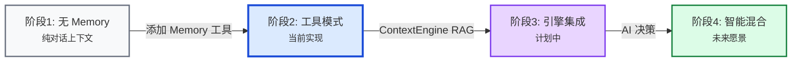

**阶段对比**：

| 阶段 | Memory 访问方式 | 优点 | 缺点 |
|------|----------------|------|------|
| **无 Memory** | 无 | 简单 | 无长期记忆 |
| **工具模式** | AI 显式调用 | 可控、透明 | 需要训练、易遗忘 |
| **引擎集成** | 自动检索 | 无缝、智能 | 复杂、可能过度检索 |
| **智能混合** | AI 决定何时 | 最佳平衡 | 实现难度最高 |

**Leon 的预测**：OpenClaw 最终会走向**智能混合模式**。AI 会根据上下文自动决定：
- 对于明确的"查询"类问题，自动触发 Memory 检索
- 对于"创作"类任务，不触发检索，避免干扰
- 对于"模糊"场景，询问用户是否需要检索

这种设计需要**更复杂的判断逻辑**，但能提供最佳的用户体验。

---

### A.4 总结：Context 的生态位

**核心结论**：Context 是 OpenClaw 的**信息中枢**，连接了 Skills、Tools、Memory 三个子系统，形成了一个完整的智能体生态系统。

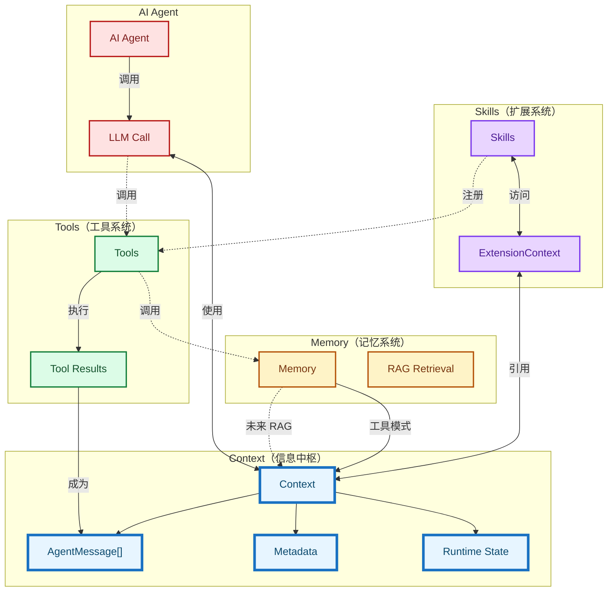

**Leon 的最终评价**：

OpenClaw 的 Context 生态设计**非常成熟**。作者没有追求"一步到位"的完美架构，而是：
1. **先实现工具模式**：简单、可控、透明
2. **预留 RAG 接口**：为未来扩展做好准备
3. **渐进式演进**：根据实际需求逐步优化

这种**务实的工程哲学**，比追求"完美架构"更有价值。Context 作为信息中枢，连接了 Skills、Tools、Memory 三个子系统，形成了一个完整的智能体生态系统。

**Leon 的预言**：未来 1-2 年内，OpenClaw 会实现：
1. **RAG ContextEngine**：自动 Memory 检索
2. **智能混合模式**：AI 决定何时检索
3. **多模态 Context**：支持图片、视频、音频
4. **分布式 Context**：跨 Agent 共享上下文

这些都不是"幻想"，而是基于当前架构的**自然演进方向**。作者已经把基础打得非常扎实了。

---

**文档版本：2026-03-19 | By Leon**
**基于源码分析：src/context-engine/*, src/agents/context.ts, src/agents/context-window-guard.ts, src/agents/sandbox/context.ts, pi-mono/packages/coding-agent/src/core/extensions/types.ts**
