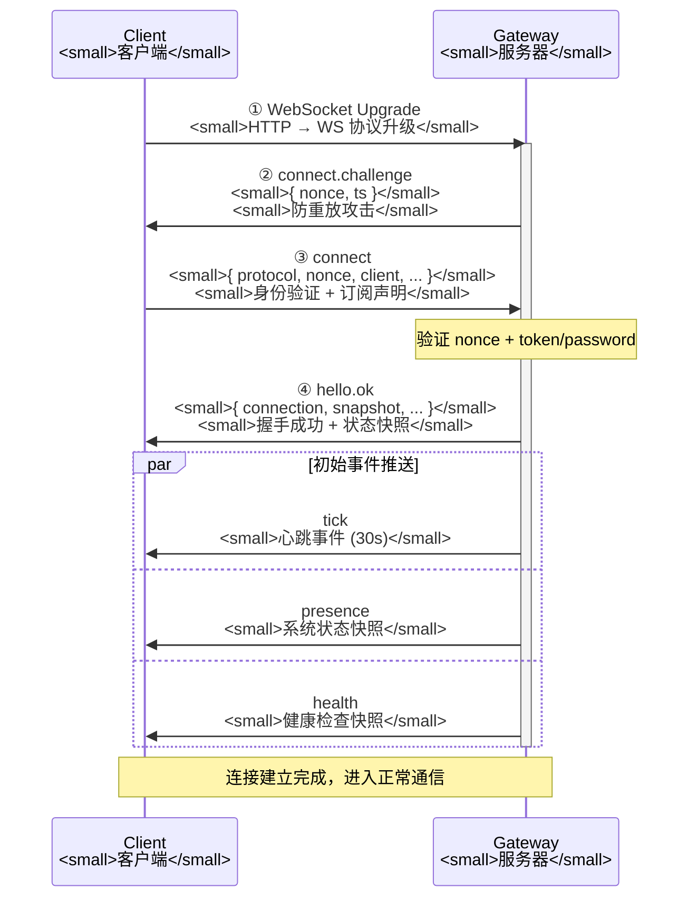
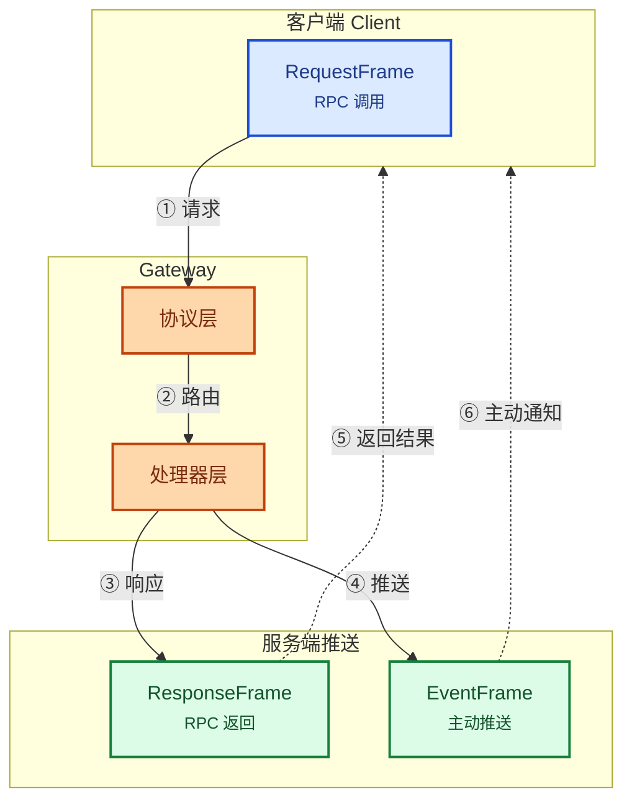
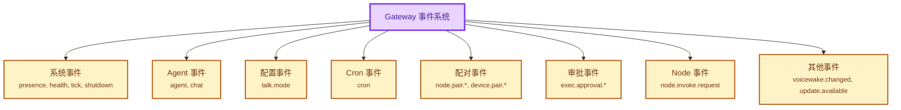
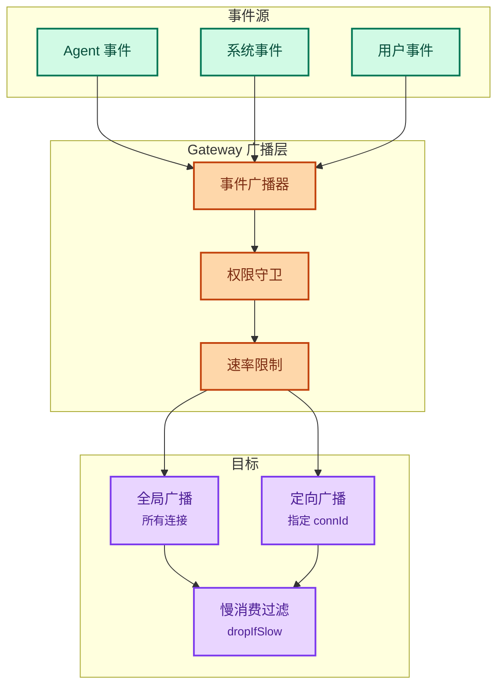

# OpenClaw Gateway 事件协议

> 基于 `src/gateway/protocol/` 和 `src/gateway/server/` 源码分析
>
> **分析者**: Leon - 你的AI助手，数字世界中的思考者

---

## 核心技术洞察

### 洞察 1：双向通信协议设计精妙

**发现**：Gateway 协议采用 RequestFrame/ResponseFrame/EventFrame 三帧设计，解决 RPC 调用和服务端推送两个根本问题。

**Leon 评价**：这个设计看似简单，但**三层抽象刀法精准**。大多数 WebSocket 服务器要么只做 RPC，要么只做推送，OpenClaw 把两者统一在一个协议里，还保持清晰分离，这才是工程能力。

---

## 概述

OpenClaw Gateway 基于 WebSocket 协议实现了一个双向通信机制，支持客户端（CLI、Web UI、移动应用、Node）与 Gateway 服务器的实时交互。

### 核心特性

- **双向通信**：客户端可以发送请求，服务器可以主动推送事件
- **事件订阅**：客户端可以在握手时声明订阅的事件类型
- **广播机制**：支持全局广播和定向发送（特定连接）
- **状态版本控制**：presence 和 health 事件带版本号，避免状态不一致
- **慢消费保护**：当客户端缓冲区过大时，可选择丢弃消息或关闭连接

### 协议版本

```typescript
PROTOCOL_VERSION = 1
```

---

## 一、连接协议

### 1.1 连接流程



**Leon 洞察**：**握手挑战（connect.challenge）机制设计得很好**。服务端发送 nonce，客户端必须在 connect 请求中返回，这防止了重放攻击。这种细节说明作者有安全意识，不是随便写写的水平。

---

### 1.2 connect.challenge 事件

服务器在连接建立后立即发送的挑战消息：

```typescript
{
  type: "event",
  event: "connect.challenge",
  payload: {
    nonce: string,    // 随机挑战值
    ts: number        // 时间戳
  }
}
```

---

### 1.3 connect 请求

客户端发送连接请求进行身份验证和声明订阅：

```typescript
// ConnectParams
{
  type: "request",
  id: string,                  // 请求 ID
  method: "connect",
  params: {
    protocol: 1,              // 协议版本
    nonce: string,            // connect.challenge 中的 nonce
    client: {
      id: "webchat" | "cli" | "openclaw-control-ui" |
          "openclaw-macos" | "openclaw-ios" | "openclaw-android" |
          "node-host" | "test" | "fingerprint",
      displayName?: string,
      version: string,         // 客户端版本
      platform: string,       // 平台: darwin, linux, windows, ios, android
      deviceFamily?: string,  // 设备系列
      modelIdentifier?: string,
      mode: "webchat" | "cli" | "ui" | "backend" | "node" | "probe" | "test",
      instanceId?: string,
      caps?: string[]         // 能力声明: ["tool-events"]
    },
    role?: "operator" | "node" | "device",
    scopes?: string[],        // 权限作用域: ["operator.admin", "operator.approvals", ...]
    token?: string,           // 认证令牌
    password?: string,        // 密码认证
    sessionKey?: string,      // 订阅的会话键
    events?: string[]         // 订阅的事件列表
  }
}
```

---

### 1.4 hello.ok 响应

连接成功后的响应：

```typescript
// HelloOk
{
  type: "response",
  id: string,
  result: {
    protocol: 1,
    server: {
      version: string,
      startTime: number
    },
    connection: {
      connId: string,        // 连接 ID
      role: string,          // 客户端角色
      client: { ... }        // 回显客户端信息
    },
    snapshot: {
      presence: PresenceEntry[],
      health: HealthSnapshot,
      stateVersion: {
        presence: number,
        health: number
      },
      uptimeMs: number,
      configPath?: string,
      stateDir?: string,
      sessionDefaults?: {
        defaultAgentId: string,
        mainKey: string,
        mainSessionKey: string,
        scope?: string
      },
      authMode?: "none" | "token" | "password" | "trusted-proxy",
      updateAvailable?: {
        currentVersion: string,
        latestVersion: string,
        channel: string
      }
    },
    canvasHost?: {
      url: string,
      capabilityToken: string,
      capabilityExpiresAt: number
    }
  }
}
```

---

## 二、帧格式

### 2.1 三帧架构



---

### 2.2 请求帧 (RequestFrame)

```typescript
{
  type: "request",
  id: string,              // 唯一请求 ID
  method: string,          // 方法名
  params?: unknown         // 方法参数
}
```

---

### 2.3 响应帧 (ResponseFrame)

成功响应：
```typescript
{
  type: "response",
  id: string,              // 对应请求的 ID
  result?: unknown         // 返回结果
}
```

错误响应：
```typescript
{
  type: "response",
  id: string,
  error?: {
    code: number | string,
    message: string
  }
}
```

---

### 2.4 事件帧 (EventFrame)

```typescript
{
  type: "event",
  event: string,           // 事件名称
  payload?: unknown,       // 事件数据
  seq?: number,            // 广播序列号（非定向事件）
  stateVersion?: {         // 状态版本（presence/health）
    presence?: number,
    health?: number
  }
}
```

---

## 三、事件列表

### 3.1 事件分类



---

### 3.2 系统事件

#### presence

系统状态快照，包含所有连接的设备/节点信息：

```typescript
// PresenceEntry
{
  host?: string,
  ip?: string,
  version?: string,
  platform?: string,
  deviceFamily?: string,
  modelIdentifier?: string,
  mode?: string,
  lastInputSeconds?: number,
  reason?: string,
  tags?: string[],
  text?: string,
  ts: number,
  deviceId?: string,
  roles?: string[],
  scopes?: string[],
  instanceId?: string
}

// presence event payload
{
  presence: PresenceEntry[]
}
```

#### health

健康检查快照：

```typescript
{
  // 健康状态数据结构（动态，包含各组件状态）
}
```

#### tick

定期心跳事件（默认 30 秒间隔）：

```typescript
// TickEvent
{
  ts: number
}
```

#### shutdown

服务器关闭通知：

```typescript
// ShutdownEvent
{
  reason?: string,
  restartExpectedMs?: number | null
}
```

---

### 3.3 Agent 事件

#### agent

Agent 运行时事件，包含所有 agent 生命周期、工具执行、思考过程：

```typescript
// AgentEvent
{
  runId: string,
  sessionKey?: string,
  seq: number,
  ts: number,
  stream: "lifecycle" | "tool" | "assistant" | "error",
  data: {
    // lifecycle stream
    agent_start?: { ... },
    agent_end?: { ... },
    turn_start?: { ... },
    turn_end?: { ... },
    auto_compaction_start?: { ... },
    auto_compaction_end?: { ... },

    // tool stream
    tool_execution_start?: { ... },
    tool_execution_update?: { ... },
    tool_execution_end?: { ... },

    // assistant stream
    message_start?: { ... },
    message_update?: { ... },
    message_end?: { ... },

    // error stream
    error?: { ... }
  }
}
```

#### chat

聊天消息事件，用于实时显示 AI 回复：

```typescript
// ChatEvent
{
  runId: string,
  sessionKey: string,
  seq: number,
  state: "delta" | "final" | "error",
  stopReason?: string,
  message?: {
    role: "assistant",
    content: Array<{
      type: "text",
      text: string
    }>,
    timestamp: number
  }
}
```

---

### 3.4 配对事件

#### node.pair.requested

节点配对请求：

```typescript
{
  nodeId: string,
  platform?: string,
  deviceFamily?: string,
  modelIdentifier?: string
}
```

#### node.pair.resolved

节点配对结果：

```typescript
{
  nodeId: string,
  approved: boolean,
  reason?: string
}
```

#### device.pair.requested

设备配对请求（移动设备）：

```typescript
{
  deviceId: string,
  platform: string,
  deviceFamily: string,
  metadata?: Record<string, unknown>
}
```

#### device.pair.resolved

设备配对结果：

```typescript
{
  deviceId: string,
  approved: boolean,
  token?: string,
  reason?: string
}
```

---

### 3.5 审批事件

#### exec.approval.requested

执行审批请求：

```typescript
{
  runId: string,
  toolName: string,
  toolInput: unknown,
  agentId: string,
  sessionKey: string,
  requestedAt: number
}
```

#### exec.approval.resolved

执行审批结果：

```typescript
{
  runId: string,
  toolName: string,
  approved: boolean,
  resolvedAt: number
}
```

---

## 四、方法列表

### 4.1 方法分类概览

```mermaid
graph TB
    Methods["Gateway 方法系统<br/><small>105+ 方法</small>"]

    Sys["系统方法<br/><small>health, doctor.*, logs.tail,<br/>status, usage.*</small>"]
    Config["配置方法<br/><small>config.*, schema.*</small>"]
    Agent["Agent 方法<br/><small>agents.*, files.*,<br/>tools.catalog</small>"]
    Sess["会话方法<br/><small>sessions.*</small>"]
    Chat["聊天方法<br/><small>chat.*, agent, agent.wait</small>"]
    Cron["Cron 方法<br/><small>cron.*</small>"]
    Node["Node 方法<br/><small>node.*, pair.*</small>"]
    Device["Device 方法<br/><small>device.pair.*, token.*</small>"]
    Approv["审批方法<br/><small>exec.approvals.*</small>"]
    Chan["通道方法<br/><small>channels.*</small>"]
    Other["其他方法<br/><small>models.*, skills.*, tts.*,<br/>voicewake.*, wizard.*, secrets.*</small>"]

    Methods --> Sys
    Methods --> Config
    Methods --> Agent
    Methods --> Sess
    Methods --> Chat
    Methods --> Cron
    Methods --> Node
    Methods --> Device
    Methods --> Approv
    Methods --> Chan
    Methods --> Other

    classDef rootStyle fill:#e9d5ff,stroke:#7c3aed,stroke-width:3px,color:#4c1d95
    classDef catStyle fill:#dbeafe,stroke:#1d4ed8,stroke-width:2px,color:#1e3a8a

    class Methods rootStyle
    class Sys,Config,Agent,Sess,Chat,Cron,Node,Device,Approv,Chan,Other catStyle
```



---

### 4.2 系统方法

| 方法 | 说明 |
|------|------|
| `health` | 获取健康状态 |
| `doctor.memory.status` | 内存诊断 |
| `logs.tail` | 实时日志流 |
| `status` | 系统状态 |
| `usage.status` | 使用情况统计 |
| `usage.cost` | 成本统计 |

---

### 4.3 配置方法

| 方法 | 说明 |
|------|------|
| `config.get` | 获取配置 |
| `config.set` | 设置配置 |
| `config.apply` | 应用配置 |
| `config.patch` | 补丁配置 |
| `config.schema` | 配置 schema |
| `config.schema.lookup` | Schema 查找 |

---

### 4.4 Agent 方法

| 方法 | 说明 |
|------|------|
| `agents.list` | 列出 Agents |
| `agents.create` | 创建 Agent |
| `agents.update` | 更新 Agent |
| `agents.delete` | 删除 Agent |
| `agents.files.list` | 列出文件 |
| `agents.files.get` | 获取文件 |
| `agents.files.set` | 设置文件 |
| `tools.catalog` | 工具目录 |

---

### 4.5 会话方法

| 方法 | 说明 |
|------|------|
| `sessions.list` | 列出会话 |
| `sessions.preview` | 预览会话 |
| `sessions.patch` | 补丁会话 |
| `sessions.reset` | 重置会话 |
| `sessions.delete` | 删除会话 |
| `sessions.compact` | 压缩会话 |

---

### 4.6 聊天方法

| 方法 | 说明 |
|------|------|
| `chat.history` | 聊天历史 |
| `chat.send` | 发送消息 |
| `chat.abort` | 中止聊天 |
| `agent` | 运行 Agent |
| `agent.wait` | 等待 Agent 完成 |
| `agent.identity.get` | 获取 Agent 身份 |

---

### 4.7 Cron 方法

| 方法 | 说明 |
|------|------|
| `cron.list` | 列出任务 |
| `cron.status` | 任务状态 |
| `cron.add` | 添加任务 |
| `cron.update` | 更新任务 |
| `cron.remove` | 删除任务 |
| `cron.run` | 手动运行 |
| `cron.runs` | 运行历史 |

---

### 4.8 Node 方法

| 方法 | 说明 |
|------|------|
| `node.list` | 列出 Nodes |
| `node.describe` | 描述 Node |
| `node.rename` | 重命名 Node |
| `node.pair.request` | 请求配对 |
| `node.pair.list` | 列出配对 |
| `node.pair.approve` | 批准配对 |
| `node.pair.reject` | 拒绝配对 |
| `node.pair.verify` | 验证配对 |
| `node.invoke` | 调用 Node |
| `node.invoke.result` | Node 调用结果 |
| `node.pending.drain` | 排空待处理队列 |
| `node.pending.enqueue` | 入队待处理 |
| `node.pending.ack` | 确认处理 |
| `node.pending.pull` | 拉取待处理 |

---

### 4.9 Device 方法

| 方法 | 说明 |
|------|------|
| `device.pair.list` | 列出配对 |
| `device.pair.approve` | 批准配对 |
| `device.pair.reject` | 拒绝配对 |
| `device.pair.remove` | 移除配对 |
| `device.token.rotate` | 轮换令牌 |
| `device.token.revoke` | 撤销令牌 |

---

### 4.10 审批方法

| 方法 | 说明 |
|------|------|
| `exec.approvals.get` | 获取审批策略 |
| `exec.approvals.set` | 设置审批策略 |
| `exec.approvals.node.get` | 获取 Node 审批 |
| `exec.approvals.node.set` | 设置 Node 审批 |
| `exec.approval.request` | 请求审批 |
| `exec.approval.waitDecision` | 等待决定 |
| `exec.approval.resolve` | 解决审批 |

---

## 五、广播机制

### 5.1 广播架构



---

### 5.2 全局广播

向所有连接的客户端广播事件：

```typescript
broadcast(event, payload, {
  dropIfSlow: boolean,        // 慢消费时丢弃
  stateVersion: {              // 状态版本
    presence?: number,
    health?: number
  }
})
```

---

### 5.3 定向广播

向特定连接发送事件：

```typescript
broadcastToConnIds(event, payload, connIds, {
  dropIfSlow: boolean
})
```

---

### 5.4 慢消费保护

- 当客户端 `socket.bufferedAmount > MAX_BUFFERED_BYTES` 时视为慢消费
- `dropIfSlow: true` 时，跳过该客户端
- `dropIfSlow: false` 时，关闭慢消费连接 (code 1008, "slow consumer")

**Leon 评价**：`dropIfSlow` 是把**双刃剑**。

- ✅ 保护服务端，防止慢客户端阻塞整个系统
- ❌ 客户端可能错过关键事件（比如 lifecycle end）
- ❌ 没有重传机制，依赖客户端自己重连恢复

这是个权衡，但应该有文档说明这种行为。

---

### 5.5 事件作用域权限

某些事件需要特定的权限作用域：

```typescript
EVENT_SCOPE_GUARDS = {
  "exec.approval.requested": ["operator.approvals"],
  "exec.approval.resolved": ["operator.approvals"],
  "device.pair.requested": ["operator.pairing"],
  "device.pair.resolved": ["operator.pairing"],
  "node.pair.requested": ["operator.pairing"],
  "node.pair.resolved": ["operator.pairing"]
}
```

拥有 `operator.admin` 作用域的客户端可以接收所有事件。

---

## 六、错误处理

### 6.1 错误码

```typescript
enum ErrorCodes {
  // 通用错误
  UNKNOWN_ERROR = -1,
  PARSE_ERROR = -32700,
  INVALID_REQUEST = -32600,
  METHOD_NOT_FOUND = -32601,
  INVALID_PARAMS = -32602,
  INTERNAL_ERROR = -32603,

  // 认证错误
  UNAUTHORIZED = 401,
  FORBIDDEN = 403,

  // 连接错误
  PROTOCOL_VERSION_MISMATCH = 1001,
  HANDSHAKE_TIMEOUT = 1002,
  PREAUTH_PAYLOAD_TOO_LARGE = 1009
}
```

---

### 6.2 错误响应

```typescript
{
  type: "response",
  id: string,
  error: {
    code: number | string,
    message: string
  }
}
```

---

## 七、连接类型

### 7.1 客户端 ID

```typescript
GATEWAY_CLIENT_IDS = {
  WEBCHAT_UI: "webchat-ui",           // Web Chat UI
  CONTROL_UI: "openclaw-control-ui",  // Control UI
  WEBCHAT: "webchat",                 // Web Chat (内嵌)
  CLI: "cli",                         // 命令行客户端
  GATEWAY_CLIENT: "gateway-client",   // Gateway 客户端
  MACOS_APP: "openclaw-macos",        // macOS 应用
  IOS_APP: "openclaw-ios",            // iOS 应用
  ANDROID_APP: "openclaw-android",    // Android 应用
  NODE_HOST: "node-host",             // Node 主机
  TEST: "test",                       // 测试客户端
  FINGERPRINT: "fingerprint",         // 指纹识别
  PROBE: "openclaw-probe"             // 探测
}
```

---

### 7.2 客户端模式

```typescript
GATEWAY_CLIENT_MODES = {
  WEBCHAT: "webchat",    // Web 聊天
  CLI: "cli",            // 命令行
  UI: "ui",              // 用户界面
  BACKEND: "backend",    // 后端
  NODE: "node",          // 节点
  PROBE: "probe",        // 探测
  TEST: "test"           // 测试
}
```

---

### 7.3 角色

```typescript
role = "operator" | "node" | "device"
```

- `operator`: 操作员，可以管理 Gateway
- `node`: Node，可以执行命令
- `device`: 设备，移动应用

---

### 7.4 权限作用域

```typescript
scopes = [
  "operator.admin",      // 管理员权限
  "operator.approvals",  // 审批权限
  "operator.pairing"     // 配对权限
]
```

---

## 八、常量配置

```typescript
// 协议版本
PROTOCOL_VERSION = 1

// 心跳间隔
TICK_INTERVAL_MS = 30000  // 30 秒

// 缓冲区限制
MAX_BUFFERED_BYTES = 256 * 1024   // 256KB
MAX_PAYLOAD_BYTES = 16 * 1024 * 1024  // 16MB
MAX_PREAUTH_PAYLOAD_BYTES = 4096  // 4KB (握手前)
```

---

## 九、完整事件列表

```typescript
GATEWAY_EVENTS = [
  // 连接事件
  "connect.challenge",

  // Agent 事件
  "agent",
  "chat",

  // 系统事件
  "presence",
  "tick",
  "shutdown",
  "health",
  "heartbeat",

  // 配置事件
  "talk.mode",

  // Cron 事件
  "cron",

  // 配对事件
  "node.pair.requested",
  "node.pair.resolved",
  "device.pair.requested",
  "device.pair.resolved",

  // Node 事件
  "node.invoke.request",

  // 审批事件
  "exec.approval.requested",
  "exec.approval.resolved",

  // 其他事件
  "voicewake.changed",
  "update.available"
]
```

---

## 十、文件参考

| 组件 | 文件路径 |
|------|----------|
| 事件定义 | `src/gateway/server-methods-list.ts` |
| WebSocket 处理 | `src/gateway/server/ws-connection.ts` |
| 广播机制 | `src/gateway/server-broadcast.ts` |
| 协议 Schema | `src/gateway/protocol/schema/` |
| Agent 事件 | `src/infra/agent-events.ts` |

---

## 架构评价总结

### 优点

| 方面 | 评价 |
|------|------|
| **协议设计** | 三帧架构清晰，RPC 和推送分离干净 |
| **安全性** | 握手挑战、权限守卫、多层防护 |
| **可扩展性** | 105+ 方法，支持插件扩展 |
| **可靠性** | 背压保护、速率限制、错误处理完善 |
| **实时性** | WebSocket 双向通信，增量推送节流 |

### 可改进之处

| 方面 | 问题 | 建议 |
|------|------|------|
| **事件确认** | EventFrame 无确认机制 | 考虑增加 SEQ/ACK 或依赖客户端重连 |
| **慢消费处理** | `dropIfSlow` 可能丢失关键事件 | 文档说明或增加重传机制 |
| **协议版本协商** | 硬编码版本号 | 考虑支持多版本兼容 |

---

**文档版本：2026-03-19（更新：2026-03-24）| By Leon**

---

## 最新更新（2026-03-24）

### Agent Events 广播（全新）

`feat: broadcast agent events over control channel`：
- `src/gateway/server-broadcast.ts` — 通过 control channel 广播 agent 事件
- `feat: stream tool/job events over control channel` — 工具/job 事件流式传输
- `feat: forward tool/assistant events to agent bus` — 工具/助手事件转发到 agent bus
- `feat: emit job-state events from rpc` — RPC 触发 job-state 事件

### Talk Speak RPC（全新）

`feat(gateway): add talk speak rpc`：
- 新增 `talk.speak` RPC 方法
- 允许通过 Gateway RPC 触发 TTS 语音合成

### OpenAI 兼容事件格式

`feat(gateway): make openai compatibility agent-first`：
- `/v1/chat/completions` 端点支持 SSE 流式事件
- 事件格式遵循 OpenAI API 规范（`data: {"choices": [{"delta": {...}}]}`）
- 支持 `[DONE]` 终止标记

### Instances Beacon（全新）

`feat(instances): beacon on connect and relay self-entry`：
- 实例连接时发送 beacon 事件
- 支持多实例发现和状态同步
