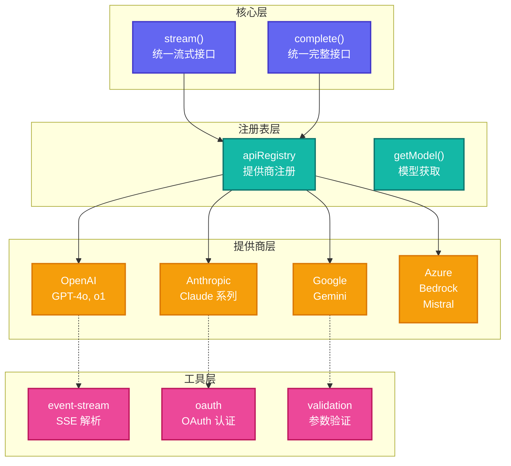

# Pi-AI: 统一多提供商 LLM API

> **源码路径**: `pi-mono/packages/ai/`

## 概述

`@mariozechner/pi-ai` 是 Pi-Mono 架构的基础层，提供统一的 LLM API 接口，抽象了多家提供商的差异，实现了：

- **自动模型发现**: 基于环境变量自动配置可用的模型
- **统一流式接口**: 标准化的 `stream()` 和 `complete()` API
- **Token 和成本追踪**: 自动计算输入/输出 token
- **跨提供商切换**: 支持会话中途切换模型

## 架构设计



## 核心文件分析

### 1. 入口文件 (`src/index.ts`)

**路径**: `pi-mono/packages/ai/src/index.ts`

导出核心 API：

```typescript
// 统一接口
export { stream, complete } from "./stream";

// 模型管理
export { getModel, getModels, getProvider, getProviders } from "./models";

// 类型定义
export type { Model, Provider, StreamEvent, CompleteResult } from "./types";

// CLI 工具
export { configureProvider, listProviders } from "./cli";
```

### 2. 提供商注册 (`src/api-registry.ts`)

**路径**: `pi-mono/packages/ai/src/api-registry.ts`

核心数据结构：

```typescript
interface ApiProvider {
  id: string;           // 提供商 ID (e.g., "anthropic")
  name: string;         // 显示名称
  models: Model[];      // 支持的模型列表
  apiKey?: string;      // API 密钥
  baseUrl?: string;     // 自定义端点
}
```

### 3. 流式处理 (`src/stream.ts`)

**路径**: `pi-mono/packages/ai/src/stream.ts`

统一的流式接口实现：

```typescript
export async function* stream(
  model: Model<any>,
  messages: Message[],
  options?: StreamOptions
): AsyncGenerator<StreamEvent> {
  // 1. 获取提供商实现
  const provider = apiRegistry.getProvider(model.provider);

  // 2. 调用提供商特定的流式实现
  yield* provider.stream(model, messages, options);
}
```

**事件类型**：

| 事件 | 描述 |
|------|------|
| `tokens` | Token 增量 |
| `cost` | 累计成本 |
| `text_delta` | 文本增量 |
| `thinking_delta` | 思考增量 |
| `tool_call_start` | 工具调用开始 |
| `tool_call_delta` | 工具参数增量 |
| `tool_call_end` | 工具调用结束 |
| `response_start` | 响应开始 |
| `response_end` | 响应结束 |
| `error` | 错误事件 |

### 4. 提供商实现 (`src/providers/`)

**路径**: `pi-mono/packages/ai/src/providers/`

每个提供商实现标准接口：

```typescript
interface ProviderImplementation {
  stream(
    model: Model<any>,
    messages: Message[],
    options: StreamOptions
  ): AsyncGenerator<StreamEvent>;

  complete?(
    model: Model<any>,
    messages: Message[],
    options: CompleteOptions
  ): Promise<CompleteResult>;
}
```

**支持的提供商**：

| 提供商 | 文件 | 特性 |
|--------|------|------|
| OpenAI | `openai-responses.ts` | GPT-4o, o1 推理 |
| Anthropic | `anthropic.ts` | Claude 扩展思考 |
| Google | `google-gemini-cli.ts` | Gemini 2.0 Flash |
| Azure | `azure-openai-responses.ts` | Azure 托管 |
| Bedrock | `amazon-bedrock.ts` | AWS 托管 |
| Mistral | `mistral.ts` | Codestral |

### 5. OAuth 认证 (`src/utils/oauth/`)

**路径**: `pi-mono/packages/ai/src/utils/oauth/`

支持 OAuth 2.0 的提供商：

- **Anthropic**: 官方 OAuth 流程
- **GitHub Copilot**: Copilot Token 交换
- ** Google Gemini CLI**: 反重力 OAuth

**PKCE 实现** (`pkce.ts`):

```typescript
export async function generatePKCE() {
  // 代码验证器
  const codeVerifier = base64UrlEncode(randomBytes(32));

  // 代码挑战
  const codeChallenge = base64UrlEncode(
    await sha256(codeVerifier)
  );

  return { codeVerifier, codeChallenge };
}
```

## 关键设计模式

### 1. 提供商注册模式

**问题**: 如何统一多个差异巨大的 LLM API？

**解决方案**: 注册表模式 + 工厂方法

```typescript
// 注册提供商
apiRegistry.registerProvider("anthropic", {
  stream: anthropicStream,
  complete: anthropicComplete,
});

// 获取并调用
const provider = apiRegistry.getProvider(model.provider);
yield* provider.stream(model, messages, options);
```

### 2. 事件流模式

**问题**: 如何统一流式响应？

**解决方案**: 标准化事件类型

```typescript
type StreamEvent =
  | { type: "tokens"; tokens: number }
  | { type: "cost"; cost: number }
  | { type: "text_delta"; delta: string }
  | { type: "tool_call_start"; toolCallId: string; toolName: string }
  | { type: "tool_call_delta"; toolCallId: string; delta: string }
  | { type: "tool_call_end"; toolCallId: string }
  | { type: "response_start"; responseId: string }
  | { type: "response_end"; responseId: string; stopReason: string };
```

### 3. 模型发现模式

**问题**: 如何自动发现可用模型？

**解决方案**: 基于环境变量的自动配置

```typescript
// 检查 API 密钥
if (process.env.ANTHROPIC_API_KEY) {
  registerAnthropicModels();
}

if (process.env.OPENAI_API_KEY) {
  registerOpenAIModels();
}
```

## 在 OpenClaw 中的使用

OpenClaw 直接使用 `@mariozechner/pi-ai` 作为其 LLM 提供商抽象层：

```typescript
// OpenClaw 中的使用示例
import { getModel, stream } from "@mariozechner/pi-ai";

// 获取模型
const model = getModel("anthropic", "claude-sonnet-4-20250514");

// 流式调用
for await (const event of stream(model, messages)) {
  // 处理事件
}
```

OpenClaw 在此基础上扩展了：
- 更多的提供商支持
- 配置管理系统
- 会话持久化

## 源码要点

### 思考模式实现

**路径**: `pi-mono/packages/ai/src/providers/openai-responses.ts`

OpenAI o1 推理模式：

```typescript
if (model.reasoningEffort) {
  // o1 系列使用 max_completion_tokens
  options.max_completion_tokens = model.reasoningEffort;
} else if (model.thinkingLevel) {
  // 其他模型不直接支持思考
  // 通过系统提示注入
}
```

**Anthropic 扩展思考**:

```typescript
if (model.thinkingLevel && model.thinkingLevel !== "off") {
  headers["anthropic-beta"] = "max-tokens-3-5-sonnet-2024-07-15";

  // 计算思考预算
  const thinkingBudget = THINKING_BUDGETS[model.thinkingLevel];
  body.thinking = {
    type: "enabled",
    budget_tokens: thinkingBudget,
  };
}
```

### 工具调用流式处理

**路径**: `pi-mono/packages/ai/src/utils/json-parse.ts`

增量 JSON 解析器：

```typescript
export function* parsePartialJSON(json: string): Generator<any> {
  // 尝试解析不完整的 JSON
  // 逐步补全并验证
  const patched = patchJSON(json);
  try {
    return JSON.parse(patched);
  } catch {
    return undefined;
  }
}
```

## 性能优化

1. **增量解析**: 工具调用参数流式解析
2. **连接复用**: HTTP Keep-Alive
3. **Token 估算**: 快速 token 计数（tiktoken）

## 参考链接

- [Pi-AI README](https://github.com/badlogic/pi-mono/tree/main/packages/ai)
- [Provider 实现](https://github.com/badlogic/pi-mono/tree/main/packages/ai/src/providers)

---

## 最新更新（2026-03-24）

### OpenClaw 中的 Pi-AI 集成变化

`src/agents/pi-model-discovery.ts` 实现模型发现：
- 通过 `InMemoryAuthStorageBackend` 隔离不同 Agent 的认证状态（内存中，不写磁盘）
- `resolvePiCredentialMapFromStore()` — 从 auth-profiles store 解析凭据映射
- `scrubLegacyStaticAuthJsonEntries()` — 清理旧版静态 auth.json 条目

`src/agents/pi-auth-credentials.ts` 管理认证凭据：
- 将 auth-profiles store 中的凭据转换为 Pi SDK 格式
- 支持多 provider 的凭据映射

### 新增 Provider 支持

通过 extensions 体系，Pi-AI 现在支持 30+ 个 provider（详见 P2 27-Providers 更新）。
