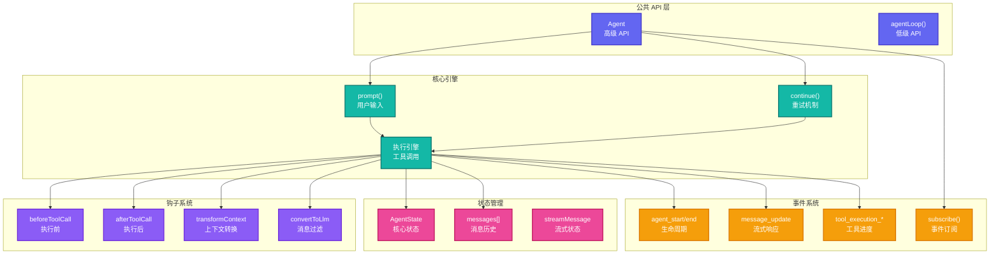
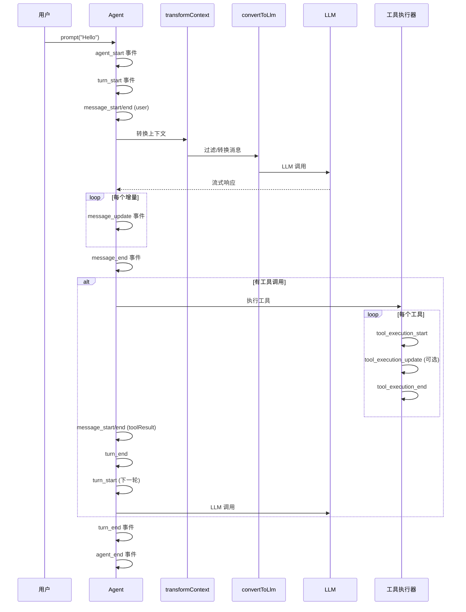
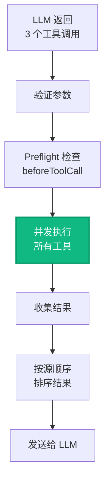

# Pi-Agent-Core: Agent 运行时

> **源码路径**: `pi-mono/packages/agent/`

## 概述

`@mariozechner/pi-agent-core` 是 Pi-Mono 的核心运行时，建立在 `pi-ai` 之上，提供：

- **有状态的 Agent 管理**: 消息历史、工具状态、错误恢复
- **事件流架构**: 实时流式响应和工具执行进度
- **工具执行引擎**: 并行/串行模式、执行钩子
- **上下文转换**: AgentMessage ↔ LLM Message 的双向转换

## 架构设计



## 核心文件分析

### 1. 类型定义 (`src/types.ts`)

**路径**: `pi-mono/packages/agent/src/types.ts`

**核心类型**：

```typescript
// Agent 消息（可通过声明合并扩展）
interface BaseAgentMessage {
  role: string;
  timestamp?: number;
}

// Agent 状态
interface AgentState {
  systemPrompt: string;
  model: Model<any>;
  thinkingLevel: ThinkingLevel;
  tools: AgentTool<any>[];
  messages: AgentMessage[];
  isStreaming: boolean;
  streamMessage: AgentMessage | null;
  pendingToolCalls: Set<string>;
  error?: string;
}

// 事件类型
type AgentEvent =
  | { type: "agent_start" }
  | { type: "agent_end"; messages: AgentMessage[] }
  | { type: "turn_start" }
  | { type: "turn_end"; message: AgentMessage; toolResults: ToolResult[] }
  | { type: "message_start"; message: AgentMessage }
  | { type: "message_update"; message: AgentMessage; assistantMessageEvent: AssistantMessageEvent }
  | { type: "message_end"; message: AgentMessage }
  | { type: "tool_execution_start"; toolCallId: string; toolName: string; args: any }
  | { type: "tool_execution_update"; toolCallId: string; partialResult: any }
  | { type: "tool_execution_end"; toolCallId: string; result: ToolResult };
```

### 2. Agent 类 (`src/agent.ts`)

**路径**: `pi-mono/packages/agent/src/agent.ts`

**核心方法**：

```typescript
class Agent {
  // 状态访问
  get state(): AgentState;

  // 提示和继续
  async prompt(input: string | AgentMessage, images?: ImageContent[]): Promise<void>;
  async continue(): Promise<void>;

  // 状态修改
  setSystemPrompt(prompt: string): void;
  setModel(model: Model<any>): void;
  setThinkingLevel(level: ThinkingLevel): void;
  setTools(tools: AgentTool<any>[]): void;
  setToolExecution(mode: "parallel" | "sequential"): void;

  // 消息管理
  replaceMessages(messages: AgentMessage[]): void;
  appendMessage(message: AgentMessage): void;
  clearMessages(): void;
  reset(): void;

  // 事件订阅
  subscribe(handler: (event: AgentEvent) => void): () => void;

  // 控制
  abort(): void;
  waitForIdle(): Promise<void>;

  // 引导和跟进
  steer(message: AgentMessage): void;
  followUp(message: AgentMessage): void;
}
```

**prompt() 流程**：



### 3. Agent Loop (`src/agent-loop.ts`)

**路径**: `pi-mono/packages/agent/src/agent-loop.ts`

低级 API 实现：

```typescript
export async function* agentLoop(
  messages: AgentMessage[],
  context: AgentContext,
  config: AgentLoopConfig
): AsyncGenerator<AgentEvent> {
  yield { type: "agent_start" };

  let currentMessages = [...messages];
  let turnNumber = 0;

  while (true) {
    yield { type: "turn_start", turnNumber };

    // 1. 转换上下文
    if (config.transformContext) {
      currentMessages = await config.transformContext(currentMessages, signal);
    }

    // 2. 转换为 LLM 格式
    const llmMessages = config.convertToLlm(currentMessages);

    // 3. 调用 LLM
    const assistantMessage = await streamLLM(llmMessages, context, config);

    // 4. 检查工具调用
    const toolCalls = extractToolCalls(assistantMessage);

    if (toolCalls.length === 0) {
      yield { type: "turn_end", message: assistantMessage, toolResults: [] };
      break;
    }

    // 5. 执行工具
    const toolResults = await executeTools(toolCalls, context, config);

    // 6. 添加工具结果消息
    currentMessages.push(assistantMessage, ...toolResults);

    yield { type: "turn_end", message: assistantMessage, toolResults };

    // 继续下一轮
    turnNumber++;
  }

  yield { type: "agent_end", messages: currentMessages };
}
```

### 4. 代理支持 (`src/proxy.ts`)

**路径**: `pi-mono/packages/agent/src/proxy.ts`

浏览器代理模式：

```typescript
export async function* streamProxy(
  model: Model<any>,
  messages: Message[],
  options: StreamProxyOptions
): AsyncGenerator<StreamEvent> {
  const { proxyUrl, authToken } = options;

  // 通过代理服务器转发请求
  const response = await fetch(`${proxyUrl}/stream`, {
    method: "POST",
    headers: {
      "Content-Type": "application/json",
      "Authorization": `Bearer ${authToken}`,
    },
    body: JSON.stringify({ model, messages, options }),
  });

  // 转发服务端事件
  const reader = response.body.getReader();
  const decoder = new TextDecoder();

  while (true) {
    const { done, value } = await reader.read();
    if (done) break;

    const chunk = decoder.decode(value);
    const lines = chunk.split("\n");

    for (const line of lines) {
      if (line.startsWith("data: ")) {
        const event = JSON.parse(line.slice(6));
        yield event;
      }
    }
  }
}
```

## 工具执行引擎

### 并行执行模式（默认）



**实现要点**：

```typescript
// 并行预检
const preflightResults = await Promise.all(
  toolCalls.map(async (toolCall) => {
    // 1. 验证参数
    const args = validateArgs(toolCall);

    // 2. 执行前钩子
    const blocked = await config.beforeToolCall?.({
      toolCall,
      args,
      context,
    });

    if (blocked?.block) {
      return { toolCall, blocked: true, reason: blocked.reason };
    }

    return { toolCall, args, blocked: false };
  })
);

// 过滤被阻止的工具
const allowedCalls = preflightResults.filter((r) => !r.blocked);

// 并发执行
const results = await Promise.all(
  allowedCalls.map(async ({ toolCall, args }) => {
    // 执行工具
    const result = await executeTool(toolCall, args, signal);

    // 执行后钩子
    const modified = await config.afterToolCall?.({
      toolCall,
      result,
      isError: false,
      context,
    });

    return { toolCall, result: modified ?? result };
  })
);

// 按源顺序重新排序
const sortedResults = sortByOriginalOrder(results, toolCalls);
```

### 串行执行模式

```typescript
for (const toolCall of toolCalls) {
  const args = validateArgs(toolCall);

  const blocked = await config.beforeToolCall?.({ toolCall, args, context });
  if (blocked?.block) continue;

  const result = await executeTool(toolCall, args, signal);

  const modified = await config.afterToolCall?.({ toolCall, result, context });

  results.push(modified ?? result);
}
```

## 消息转换机制

### AgentMessage → LLM Message

```typescript
// 默认实现
const defaultConvertToLlm = (messages: AgentMessage[]): Message[] => {
  return messages.filter((msg) => {
    // 只保留 LLM 理解的角色
    return ["user", "assistant", "toolResult"].includes(msg.role);
  });
};
```

**自定义消息类型**：

```typescript
// 1. 扩展 AgentMessage
declare module "@mariozechner/pi-agent-core" {
  interface CustomAgentMessages {
    notification: { role: "notification"; text: string; timestamp: number };
  }
}

// 2. 自定义转换
const agent = new Agent({
  convertToLlm: (messages) => {
    return messages
      .filter((msg) => msg.role !== "notification") // 过滤通知
      .map((msg) => {
        if (msg.role === "custom") {
          // 转换自定义类型
          return { role: "user", content: msg.content };
        }
        return msg;
      });
  },
});
```

### 上下文转换

```typescript
// 上下文压缩示例
const transformContext = async (messages: AgentMessage[]) => {
  const MAX_MESSAGES = 50;
  if (messages.length <= MAX_MESSAGES) return messages;

  // 保留系统消息
  const systemMessages = messages.filter((m) => m.role === "system");

  // 保留最近的消息
  const recentMessages = messages.slice(-MAX_MESSAGES);

  return [...systemMessages, ...recentMessages];
};
```

## 引导和跟进机制

### 引导（Steering）

在工具执行期间中断 Agent：

```typescript
// 用户中断
agent.steer({
  role: "user",
  content: "停止！做这个代替。",
  timestamp: Date.now(),
});

// 检查引导消息
if (steeringQueue.length > 0) {
  // 在下一轮注入引导消息
  currentMessages.push(...steeringQueue);
  steeringQueue = [];
  continue; // 继续循环
}
```

### 跟进（Follow-up）

在 Agent 完成后添加工作：

```typescript
// 跟进任务
agent.followUp({
  role: "user",
  content: "同时总结结果。",
  timestamp: Date.now(),
});

// 检查跟进
if (toolCalls.length === 0 && followUpQueue.length > 0) {
  // 注入跟进消息并继续
  currentMessages.push(...followUpQueue);
  followUpQueue = [];
  continue; // 不退出循环
}
```

## 在 OpenClaw 中的使用

OpenClaw 基于 `@mariozechner/pi-agent-core` 构建其 Agent 系统：

```typescript
// OpenClaw 扩展了 Agent 类
import { Agent } from "@mariozechner/pi-agent-core";

class OpenClawAgent extends Agent {
  // 添加通道支持
  // 添加会话管理
  // 添加工具注册
}
```

OpenClaw 在此基础上添加了：
- 多通道消息路由
- 会话持久化到数据库
- 工具自动发现和注册
- Hook 系统（扩展钩子）

## 源码要点

### 流式状态更新

**路径**: `pi-mono/packages/agent/src/agent.ts`

```typescript
private updateStreamMessage(partial: AssistantMessage) {
  this.state.streamMessage = {
    role: "assistant",
    timestamp: Date.now(),
    ...partial,
  };
  this.state.isStreaming = true;

  this.emit({
    type: "message_update",
    message: this.state.streamMessage,
    assistantMessageEvent: extractAssistantEvent(partial),
  });
}
```

### 工具执行中止

```typescript
// AbortController 级联
const controller = new AbortController();

// 传递给工具
executeTool(toolCall, args, controller.signal);

// 用户中止
agent.abort(); // 内部调用 controller.abort()

// 工具检查中止
execute: async (toolCallId, params, signal, onUpdate) => {
  while (workToDo) {
    if (signal.aborted) {
      throw new Error("Tool execution aborted");
    }
    // ... 执行工作
  }
}
```

## 参考链接

- [Pi-Agent-Core README](https://github.com/badlogic/pi-mono/tree/main/packages/agent)
- [Agent API 文档](https://github.com/badlogic/pi-mono/tree/main/packages/agent/README.md)
