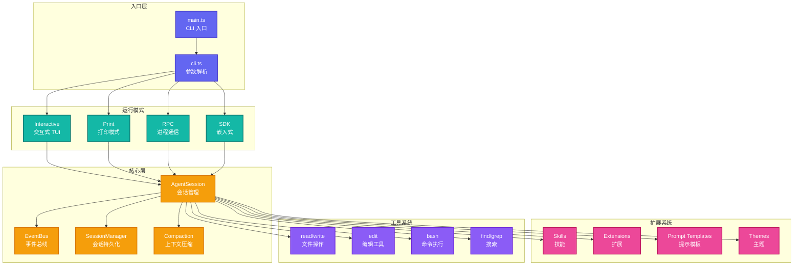

# Pi-Coding-Agent: 交互式编程代理

> **源码路径**: `pi-mono/packages/coding-agent/`

## 概述

`pi-coding-agent` 是 Pi-Mono 的主要应用层包，提供一个极简的终端编程工具。它的设计哲学是 **"适配 pi 到你的工作流，而不是相反"**。

## 核心特性

- **四种运行模式**: 交互式、打印、JSON、RPC
- **可扩展系统**: Extensions、Skills、Prompt Templates、Themes
- **会话管理**: 分支、压缩、导出
- **内置工具**: read、write、edit、bash
- **模型支持**: 多提供商、OAuth 认证

## 架构设计



## 核心文件分析

### 1. CLI 入口 (`src/cli.ts`)

**路径**: `pi-mono/packages/coding-agent/src/cli.ts`

**参数解析**：

```typescript
interface CliArgs {
  // 输入
  message?: string;           // 直接提示消息
  messageFile?: string;       // 从文件读取消息
  images?: string[];          // 附加图片

  // 模式
  print?: boolean;            // 打印模式
  json?: boolean;             // JSON 模式
  rpc?: boolean;              // RPC 模式
  sdk?: boolean;              // SDK 模式

  // 会话
  session?: string;           // 恢复会话
  newSession?: boolean;       // 新建会话

  // 模型
  model?: string;             // 模型选择

  // 配置
  config?: string;            // 配置文件路径
  setting?: string[];         // 设置覆盖
  context?: string[];         // 上下文文件

  // 其他
  nonInteractive?: boolean;   // 非交互模式
  noConfirm?: boolean;        // 跳过确认
}
```

### 2. 交互式模式 (`src/modes/interactive/`)

**路径**: `pi-mono/packages/coding-agent/src/modes/interactive/interactive-mode.ts`

**核心组件**：

```typescript
class InteractiveMode {
  // TUI 组件
  private armin: ArminComponent;          // 主界面
  private footer: FooterComponent;        // 状态栏
  private editor: CustomEditorComponent;  // 编辑器

  // 状态
  private agentSession: AgentSession;
  private eventBus: EventBus;

  // 方法
  async start(): Promise<void>;
  private handleInput(input: string): Promise<void>;
  private renderMessage(message: Message): void;
  private handleToolCall(toolCall: ToolCall): Promise<void>;
}
```

**Armin 组件** (`components/armin.ts`):

```typescript
// 基于 pi-tui 的主界面组件
class ArminComponent {
  // 消息渲染
  private messages: MessageComponent[] = [];

  // 差异渲染
  render(): string {
    return this.messages
      .map((m) => m.render())
      .join("\n");
  }
}
```

### 3. Agent 会话 (`src/core/agent-session.ts`)

**路径**: `pi-mono/packages/coding-agent/src/core/agent-session.ts`

**会话管理核心**：

```typescript
class AgentSession {
  // Agent 实例
  private agent: Agent;

  // 配置
  private config: PiConfig;
  private tools: AgentTool<any>[];

  // 生命周期
  async initialize(): Promise<void>;
  async prompt(input: string, images?: Image[]): Promise<void>;
  async continue(): Promise<void>;
  async abort(): Promise<void>;

  // 事件处理
  private handleEvent(event: AgentEvent): void;
  private emit(event: PiEvent): void;
}
```

### 4. 会话管理器 (`src/core/session-manager.ts`)

**路径**: `pi-mono/packages/coding-agent/src/core/session-manager.ts`

**会话持久化**：

```typescript
interface Session {
  id: string;
  title: string;
  createdAt: number;
  updatedAt: number;
  model: Model<any>;
  systemPrompt: string;
  messages: AgentMessage[];
  branch?: string;  // 分支信息
}

class SessionManager {
  // CRUD 操作
  async createSession(): Promise<Session>;
  async saveSession(session: Session): Promise<void>;
  async loadSession(id: string): Promise<Session>;
  async listSessions(): Promise<Session[]>;
  async deleteSession(id: string): Promise<void>;

  // 分支管理
  async createBranch(sessionId: string, branchId: string): Promise<void>;
  async listBranches(sessionId: string): Promise<string[]>;
}
```

### 5. 上下文压缩 (`src/core/compaction/`)

**路径**: `pi-mono/packages/coding-agent/src/core/compaction/`

**压缩策略**：

```typescript
interface CompactionStrategy {
  // 分支压缩
  branchSummarization(
    messages: AgentMessage[]
  ): Promise<AgentMessage[]>;

  // 紧凑化
  compact(messages: AgentMessage[]): AgentMessage[];
}
```

**分支总结实现** (`branch-summarization.ts`):

```typescript
async function branchSummarization(
  messages: AgentMessage[]
): Promise<AgentMessage[]> {
  // 1. 识别分支点
  const branchPoint = findBranchPoint(messages);

  // 2. 提取分支消息
  const branchMessages = messages.slice(branchPoint);

  // 3. 调用 LLM 总结
  const summary = await summarizeBranch(branchMessages);

  // 4. 替换分支消息
  return [
    ...messages.slice(0, branchPoint),
    {
      role: "compaction_summary",
      content: summary,
      timestamp: Date.now(),
    },
  ];
}
```

### 6. 扩展系统 (`src/core/extensions/`)

**路径**: `pi-mono/packages/coding-agent/src/core/extensions/`

**扩展类型**：

```typescript
// Skill: 单一功能扩展
interface Skill {
  name: string;
  description?: string;
  trigger?: (event: PiEvent) => boolean;
  execute: (context: SkillContext) => Promise<void>;
}

// Extension: 复杂功能包
interface Extension {
  name: string;
  version: string;
  skills?: Skill[];
  tools?: AgentTool<any>[];
  slashCommands?: SlashCommand[];
  promptTemplates?: PromptTemplate[];
}

// Prompt Template: 提示模板
interface PromptTemplate {
  name: string;
  description?: string;
  systemPrompt?: string;
  model?: Model<any>;
  tools?: AgentTool<any>[];
}

// Theme: 主题
interface Theme {
  name: string;
  colors: ThemeColors;
  styles?: ThemeStyles;
}
```

**扩展加载器** (`loader.ts`):

```typescript
class ExtensionLoader {
  // 加载本地扩展
  async loadLocal(path: string): Promise<Extension>;

  // 加载 npm 包
  async loadNpm(packageName: string): Promise<Extension>;

  // 加载 git 仓库
  async loadGit(repoUrl: string): Promise<Extension>;

  // 验证扩展
  private validate(extension: Extension): void;
}
```

### 7. 工具系统 (`src/core/tools/`)

**路径**: `pi-mono/packages/coding-agent/src/core/tools/`

**内置工具**：

| 工具 | 文件 | 功能 |
|------|------|------|
| read | `read.ts` | 读取文件内容 |
| write | `write.ts` | 写入文件 |
| edit | `edit.ts` | 编辑文件（替换） |
| edit-diff | `edit-diff.ts` | 差异编辑 |
| bash | `bash.ts` | 执行 Shell 命令 |
| find | `find.ts` | 查找文件 |
| grep | `grep.ts` | 搜索文件内容 |
| ls | `ls.ts` | 列出目录 |
| truncate | `truncate.ts` | 截断长输出 |

**Bash 工具实现** (`bash.ts`):

```typescript
const bashTool: AgentTool = {
  name: "bash",
  label: "Bash",
  description: "Run a shell command",
  parameters: Type.Object({
    command: Type.String({ description: "Command to run" }),
  }),
  execute: async (toolCallId, params, signal, onUpdate) => {
    const { command } = params;

    // 创建子进程
    const proc = Bun.spawn(["sh", "-c", command], {
      stdout: "pipe",
      stderr: "pipe",
    });

    // 流式输出
    const stream = new ReadableStream({
      async start(controller) {
        const reader = proc.stdout.getReader();
        while (true) {
          const { done, value } = await reader.read();
          if (done) break;

          const text = new TextDecoder().decode(value);
          onUpdate?.({
            content: [{ type: "text", text }],
            details: {},
          });
        }
        controller.close();
      },
    });

    // 等待完成
    const exitCode = await proc.exited;

    return {
      content: [
        {
          type: "text",
          text: `Exit code: ${exitCode}`,
        },
      ],
      details: { exitCode },
    };
  },
};
```

### 8. 事件总线 (`src/core/event-bus.ts`)

**路径**: `pi-mono/packages/coding-agent/src/core/event-bus.ts`

**事件系统**：

```typescript
type PiEvent =
  | AgentEvent  // Agent 事件
  | { type: "session_created"; session: Session }
  | { type: "session_saved"; session: Session }
  | { type: "extension_loaded"; extension: Extension }
  | { type: "tool_executed"; tool: string; result: any }
  | { type: "error"; error: Error };

class EventBus {
  private listeners: Map<string, Set<Listener>> = new Map();

  on(event: string, listener: Listener): () => void;
  off(event: string, listener: Listener): void;
  emit(event: PiEvent): void;
  once(event: string, listener: Listener): () => void;
}
```

## 运行模式

### 1. 交互式模式

默认模式，提供 TUI 界面：

```bash
pi
```

**特性**：
- 差异渲染终端 UI
- 键盘快捷键
- 消息队列
- 实时流式输出

### 2. 打印模式

简单输入输出：

```bash
pi --print "What is 2+2?"
```

**特性**：
- 无 TUI 开销
- 适合脚本
- 支持 `--json` 输出

### 3. RPC 模式

进程间通信：

```bash
pi --rpc
```

**协议**: JSONL (JSON Lines)

```json
{"type": "prompt", "content": "Hello"}
{"type": "event", "event": {"type": "message_start", ...}}
{"type": "event", "event": {"type": "text_delta", "delta": "Hi"}}
...
```

### 4. SDK 模式

嵌入式使用：

```typescript
import { PiSDK } from "@mariozechner/pi-coding-agent/sdk";

const pi = new PiSDK({
  model: getModel("anthropic", "claude-sonnet-4-20250514"),
});

await pi.prompt("Help me debug this code");
```

## 与 OpenClaw 的关系

`pi-coding-agent` 是一个独立的终端编程工具，与 OpenClaw 是平行项目：

- **共享依赖**: 两者都使用 `@mariozechner/pi-agent-core`
- **不同定位**: pi-coding-agent 专注终端编程，OpenClaw 专注多通道个人助手
- **可借鉴**: pi-coding-agent 的扩展系统（Skills/Extensions）为 OpenClaw 的 Plugin SDK 提供了设计灵感

OpenClaw 没有直接使用 `pi-coding-agent`，但两者可以共享：
- Skills 定义
- Prompt Templates
- 工具实现

## 设计哲学

1. **极简主义**: 只包含核心功能，其余通过扩展
2. **可组合性**: 小而专的组件可以组合成复杂功能
3. **可扩展性**: 四种扩展机制覆盖不同场景
4. **用户控制**: 用户决定如何工作，而非工具强加

## 源码要点

### 差异渲染优化

**路径**: `pi-mono/packages/coding-agent/src/modes/interactive/components/armin.ts`

```typescript
// 只更新变化的部分
class ArminComponent {
  private lastRender: string = "";

  render(): string {
    const current = this.buildRender();

    if (current === this.lastRender) {
      return "";  // 无变化，不输出
    }

    // 计算差异并输出
    const diff = computeDiff(this.lastRender, current);
    this.lastRender = current;

    return diff;
  }
}
```

### 图片处理

**路径**: `pi-mono/packages/coding-agent/src/utils/image-resize.ts`

```typescript
// 自动调整图片大小
async function resizeImage(image: Buffer): Promise<Buffer> {
  const MAX_SIZE = 20 * 1024 * 1024;  // 20MB
  const MAX_DIMENSION = 2048;

  if (image.length <= MAX_SIZE) {
    return image;
  }

  // 使用 sharp 调整大小
  return await sharp(image)
    .resize(MAX_DIMENSION, MAX_DIMENSION, {
      fit: "inside",
      withoutEnlargement: true,
    })
    .toBuffer();
}
```

## 参考链接

- [Pi-Coding-Agent README](https://github.com/badlogic/pi-mono/tree/main/packages/coding-agent)
- [官方文档](https://shittycodingagent.ai)
- [Discord 社区](https://discord.com/invite/3cU7Bz4UPx)
