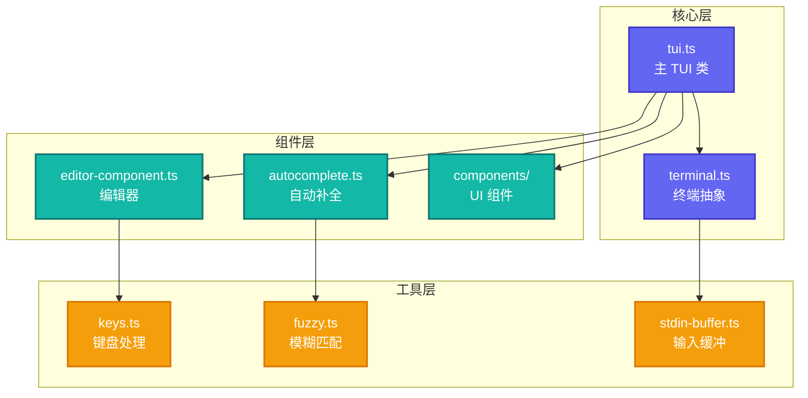

# Pi-TUI: 终端 UI 库

> **源码路径**: `pi-mono/packages/tui/`

## 概述

`@mariozechner/pi-tui` 是一个专为终端交互设计的 UI 库，采用**差异渲染**技术实现高效刷新。

## 核心特性

- **差异渲染**: 只重绘变化的部分
- **组件系统**: 可组合的 UI 组件
- **键盘处理**: 全面的键盘事件支持
- **自动补全**: 内置模糊匹配自动补全
- **图片支持**: 终端内图片渲染

## 架构设计



## 核心文件

### 1. 主 TUI 类 (`src/tui.ts`)

**路径**: `pi-mono/packages/tui/src/tui.ts`

**核心 API**:

```typescript
class Tui {
  // 渲染
  render(content: string): void;
  clear(): void;

  // 光标控制
  showCursor(): void;
  hideCursor(): void;
  moveCursor(x: number, y: number): void;

  // 屏幕
  getDimensions(): { width: number; height: number };

  // 原始模式
  setRawMode(enable: boolean): void;
}
```

### 2. 键盘处理 (`src/keys.ts`)

**路径**: `pi-mono/packages/tui/src/keys.ts`

支持完整的键盘事件：

```typescript
type KeyPressEvent =
  | { type: "keypress"; key: string; ctrl: boolean; alt: boolean; shift: boolean }
  | { type: "special"; key: "up" | "down" | "left" | "right" | "enter" | "escape" | "backspace" | "delete" | "tab" }
  | { type: "paste"; content: string };  // 终端粘贴事件
```

### 3. 自动补全 (`src/autocomplete.ts`)

**路径**: `pi-mono/packages/tui/src/autocomplete.ts`

模糊匹配自动补全：

```typescript
class Autocomplete {
  // 建议列表
  private suggestions: string[] = [];

  // 模糊匹配
  complete(input: string): string[];

  // 渲染补全菜单
  render(selected: number): string;
}
```

## 差异渲染实现

**核心原理**：

```typescript
class Tui {
  private lastRender: string = "";

  render(content: string): void {
    if (content === this.lastRender) {
      return;  // 无变化
    }

    // 计算差异
    const diff = computeDiff(this.lastRender, content);

    // 只输出变化部分
    process.stdout.write(diff);

    this.lastRender = content;
  }
}
```

**差异计算**：

1. **行级别差异**: 比较每一行
2. **光标定位**: 移动到变化位置
3. **清除到行尾**: 删除旧内容
4. **写入新内容**: 输出新行

## 在 OpenClaw 中的使用

OpenClaw 的 CLI 和 Wizard 系统使用了 `@mariozechner/pi-tui`：

- **交互式向导**: `openclaw onboard` 使用 pi-tui 组件
- **配置选择器**: 模型、通道配置的选择界面
- **键盘处理**: 统一的键盘事件处理

## 参考链接

- [Pi-TUI 源码](https://github.com/badlogic/pi-mono/tree/main/packages/tui)

---

## 最新更新（2026-03-24）

本章节内容相对稳定。pi-mono 仓库路径：`/Users/rainleon/data/devSpace/ageoss/openclaw_space/pi-mono/`。主要变化体现在与 openclaw 主仓库的集成方式上，详见 08-MainAgent与pi-coding-agent关系.md 的更新说明。
