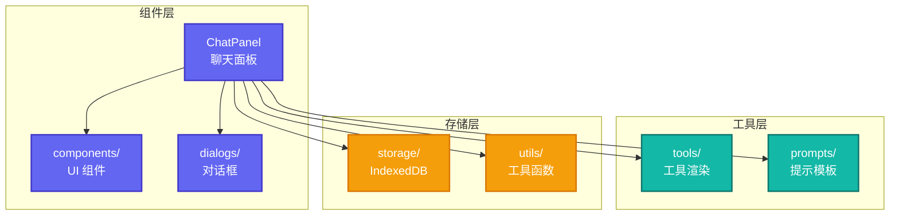

# Pi-Web-UI: Web 聊天界面组件

> **源码路径**: `pi-mono/packages/web-ui/`

## 概述

`@mariozechner/pi-web-ui` 提供 Web Components 形式的聊天界面组件，支持在任何 Web 框架中使用。

## 核心特性

- **Web Components**: 框架无关
- **实时流式**: 支持流式响应
- **工具调用**: 可视化工具执行
- **本地存储**: IndexedDB 会话持久化
- **主题支持**: 可自定义样式

## 架构设计



## 核心文件

### 1. ChatPanel (`src/ChatPanel.ts`)

**路径**: `pi-mono/packages/web-ui/src/ChatPanel.ts`

主聊天面板组件：

```typescript
class ChatPanel extends HTMLElement {
  // 消息列表
  private messages: Message[] = [];

  // 流式响应
  async *stream(prompt: string): AsyncGenerator<MessageDelta>;

  // 工具执行
  async executeTool(toolCall: ToolCall): Promise<ToolResult>;

  // 会话管理
  saveSession(): Promise<void>;
  loadSession(id: string): Promise<void>;
}

// 注册为自定义元素
customElements.define("chat-panel", ChatPanel);
```

**使用示例**：

```html
<chat-panel
  model="anthropic:claude-sonnet-4-20250514"
  api-key="sk-ant-..."
></chat-panel>

<script>
  const panel = document.querySelector("chat-panel");

  // 发送消息
  panel.prompt("Hello!");
</script>
```

### 2. 工具渲染 (`src/tools/`)

**路径**: `pi-mono/packages/web-ui/src/tools/`

可视化工具执行过程：

```typescript
interface ToolRenderer {
  // 渲染工具调用
  renderToolCall(toolCall: ToolCall): string;

  // 渲染工具结果
  renderToolResult(result: ToolResult): string;

  // 流式更新
  renderProgress(partial: PartialResult): string;
}
```

### 3. 本地存储 (`src/storage/`)

**路径**: `pi-mono/packages/web-ui/src/storage/`

IndexedDB 会话持久化：

```typescript
class SessionStorage {
  // 保存会话
  async save(session: Session): Promise<void>;

  // 加载会话
  async load(id: string): Promise<Session>;

  // 列出会话
  async list(): Promise<Session[]>;
}
```

## 与 OpenClaw Web Provider 的关系

OpenClaw 的 Web Provider（`src/provider-web.ts`）是一个独立的 Web UI 实现，使用 React 构建。

两者可以互补：
- **pi-web-ui**: 适合集成到第三方 Web 应用
- **OpenClaw Web UI**: 深度集成 OpenClaw 功能，支持更多特性

## 参考链接

- [Pi-Web-UI 源码](https://github.com/badlogic/pi-mono/tree/main/packages/web-ui)
