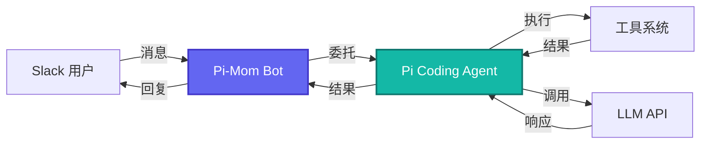

# Pi-Mom: Slack Bot 集成

> **源码路径**: `pi-mono/packages/mom/`

## 概述

`pi-mom` 是一个 Slack Bot，将 Slack 消息委托给 pi coding agent 处理，实现 Slack 界面的 AI 编程助手。

## 核心特性

- **Slack 集成**: 完整的 Slack API 支持
- **消息委托**: 转发消息给 pi agent
- **结果返回**: 将 agent 响应返回 Slack
- **线程支持**: 支持线程上下文

## 架构设计

## 核心功能

### 消息流处理

1. **接收消息**: 监听 Slack 事件
2. **上下文构建**: 包含线程历史
3. **Agent 调用**: 调用 pi-coding-agent
4. **流式响应**: 实时返回结果
5. **工具渲染**: 可视化工具执行

### 使用场景

- 团队协作编程
- 代码审查
- 问题诊断
- 文档生成

## 与 OpenClaw 的关系

`pi-mom` 是一个 Slack Bot 实现，展示了如何使用 `pi-agent-core` 构建单通道 AI 助手。

OpenClaw 自带 Slack 通道支持（`src/slack`），功能更完整：
- 深度集成 Gateway
- 支持会话管理
- 支持工具调用
- 支持多通道并发

## 参考链接

- [Pi-Mom 源码](https://github.com/badlogic/pi-mono/tree/main/packages/mom)
