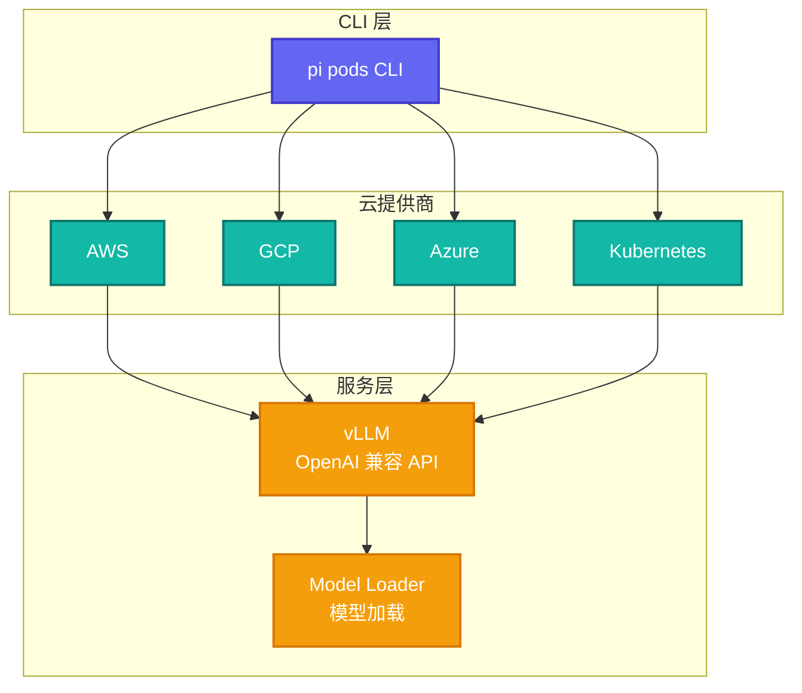

# Pi-Pods: GPU Pod 部署管理

> **源码路径**: `pi-mono/packages/pods/`

## 概述

`pi-pods` 是一个 CLI 工具，用于管理 GPU Pod 上的 vLLM 部署，简化自托管 LLM 的部署流程。

## 核心特性

- **Pod 管理**: 创建、删除、列表 Pod
- **vLLM 部署**: 自动配置 vLLM 服务
- **GPU 调度**: 优化 GPU 资源使用
- **健康检查**: 自动监控服务状态

## 架构设计



## 核心命令

### Pod 管理

```bash
# 创建 Pod
pi pods create --model meta-llama/Llama-3.1-8B --gpus 1

# 列出 Pod
pi pods list

# 删除 Pod
pi pods delete <pod-id>

# 查看 Pod 状态
pi pods status <pod-id>
```

### 模型管理

```bash
# 列出可用模型
pi pods models list

# 拉取模型
pi pods models pull meta-llama/Llama-3.1-8B

# 删除模型
pi pods models delete meta-llama/Llama-3.1-8B
```

## vLLM 配置

**自动生成的配置**：

```python
# vLLM 启动参数
vllm serve meta-llama/Llama-3.1-8B \
  --tensor-parallel-size 1 \
  --gpu-memory-utilization 0.9 \
  --max-model-len 8192 \
  --port 8000 \
  --host 0.0.0.0
```

## OpenAI 兼容性

部署的 vLLM 服务完全兼容 OpenAI API：

```typescript
import { getModel } from "@mariozechner/pi-ai";

const model = getModel("custom", "llama-3.1-8b", {
  apiKey: "dummy",
  baseUrl: "http://pod-ip:8000/v1",
});

await stream(model, messages);
```

## 与 OpenClaw 的关系

`pi-pods` 是一个独立的工具，用于管理 GPU Pod 上的 vLLM 部署。

虽然 OpenClaw 不直接使用 `pi-pods`，但两者可以配合使用：
1. 使用 `pi-pods` 部署自托管 LLM
2. 在 OpenClaw 中配置自定义模型端点
3. 实现完全离线的 AI 助手

## 参考链接

- [Pi-Pods 源码](https://github.com/badlogic/pi-mono/tree/main/packages/pods)
- [vLLM 文档](https://docs.vllm.ai/)
