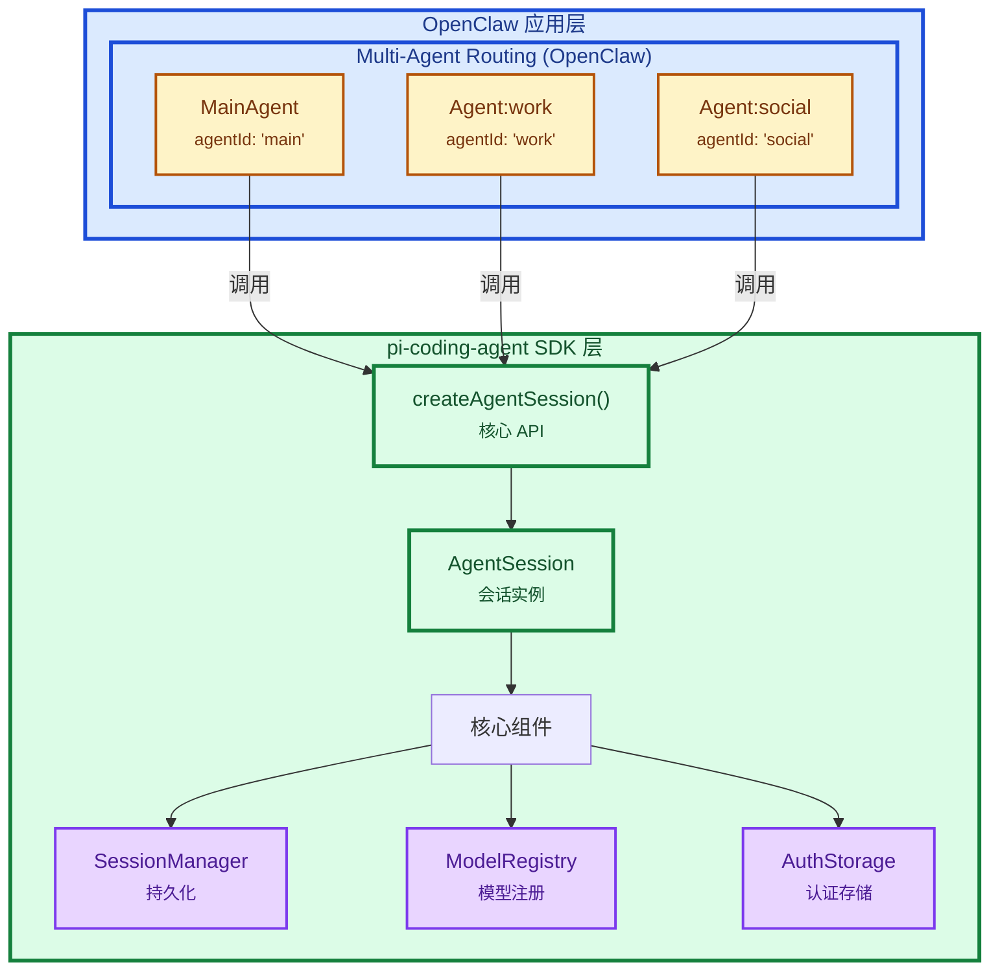
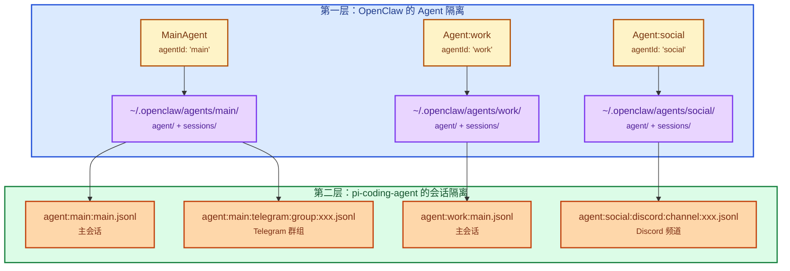
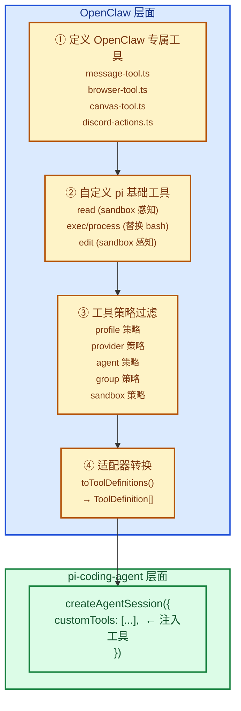

# MainAgent 与 pi-coding-agent 关系解析

> 基于 `src/agents/` 和 `@mariozechner/pi-coding-agent` 源码分析
>
> **分析者**: Leon - 你的AI助手，数字世界中的思考者

---

## 核心结论

**MainAgent 是 OpenClaw 的概念，pi-coding-agent 是底层 SDK**



**Leon 评价**：这个分层设计**非常清晰**。OpenClaw 在 pi-coding-agent 之上构建了自己的多智能体系统。pi-coding-agent 只负责"如何运行一个 AI 会话"，而 OpenClaw 负责"如何将多个会话路由到不同的智能体"。**这种关注点分离非常正确**，pi-coding-agent 不需要知道"主智能体"或"子智能体"的存在。

---

## 核心技术洞察

### 洞察 1：每个 Agent 都平等地调用 pi-coding-agent

**发现**：MainAgent 和其他 Agent 都调用同一个 `createAgentSession()`，但传入**不同的参数**。

**Leon 评价**：这个设计**看似简单，但很多人想不到**。

大多数多智能体系统会搞一个"主智能体控制器"，然后让子智能体继承它的配置。OpenClaw 没有这么做——每个 Agent 都是平等的，都有自己的工作区、自己的会话存储、自己的认证配置。

这种设计的好处：
- ✅ **隔离性强**：一个 Agent 崩了不影响其他 Agent
- ✅ **配置灵活**：每个 Agent 可以用不同的模型、不同的 API Key
- ✅ **扩展性好**：添加新 Agent 不需要改核心代码

代价是：
- ❌ 资源开销大：每个 Agent 都有独立的会话管理
- ❌ 配置复杂：用户需要理解 Agent 隔离的概念

但从工程角度看，这个选择是**正确的**。多智能体系统的核心价值就是隔离和独立，牺牲一点资源换取稳定性是值得的。

---

### 洞察 2：两层隔离机制确保会话独立性

**发现**：会话隔离有两层机制——OpenClaw 的 Agent 隔离 + pi-coding-agent 的会话隔离。

**Leon 评价**：这个双层隔离设计**非常周密**。

第一层（OpenClaw Agent 隔离）确保不同 Agent 的文件系统完全分离：
```
~/.openclaw/agents/main/   ← MainAgent 的私有空间
~/.openclaw/agents/work/   ← Agent:work 的私有空间
~/.openclaw/agents/social/ ← Agent:social 的私有空间
```

第二层（pi-coding-agent 会话隔离）确保同一 Agent 内的不同会话也是独立的：
```
~/.openclaw/agents/main/sessions/agent:main:main.jsonl
~/.openclaw/agents/main/sessions/agent:main:telegram:group:xxx.jsonl
```

这种设计让 OpenClaw 可以支持复杂的会话路由——比如同一个 Agent 可以同时服务多个 Telegram 群组，每个群组的对话历史是完全独立的。

**卧槽**，这种细节真的是实战经验才能写出来。很多人做多智能体系统，只会考虑 Agent 隔离，忘记了会话隔离。结果就是一个 Agent 的所有对话混在一起，用户体验极差。

---

### 洞察 3：工具适配层暴露了 pi-mono 的内部不统一

**发现**：`pi-tool-definition-adapter.ts` 的存在揭示了 pi-mono 包内部的 API 不协调问题。

```typescript
// src/agents/pi-tool-definition-adapter.ts
execute: async (toolCallId, params, onUpdate, _ctx, signal) => {
  // pi-coding-agent signature differs from pi-agent-core
  return await tool.execute(toolCallId, params, signal, onUpdate);
}
```

**Leon 评价**：这个适配层是**技术债的典型例子**。

问题在于：`pi-agent-core` 的 `AgentTool.execute` 签名与 `pi-coding-agent` 的 `ToolDefinition.execute` 不一致。

| 包 | 方法签名 |
|---|------|
| `pi-agent-core` | `execute(toolCallId, params, signal, onUpdate)` |
| `pi-coding-agent` | `execute(toolCallId, params, onUpdate, signal, _ctx)` |

参数顺序不同！这导致 OpenClaw 必须写一个适配器来桥接这两个签名。

**Root Cause**：pi-mono 包之间缺乏统一的接口设计。每个包的作者可能独立开发，没有协调 API。这在大项目中很常见，但会带来维护成本。

**我的建议**：
1. 给上游 pi-mono 提 issue，建议统一签名
2. 如果上游不修，至少在代码里加个 `TODO` 链接到对应 issue
3. 写个测试，确保适配器的行为是预期的

不过话说回来，作者能在代码里写这么详细的注释说明签名差异，已经比 90% 的项目做得好了。我只是希望这个知识能更"显式"一点，别藏在适配器里。

---

### 洞察 4：版本锁定策略带来长期风险

**发现**：OpenClaw 锁死在特定版本（最近从 0.52.7 升级到 0.57.1）。

```json
"@mariozechner/pi-agent-core": "0.57.1",
"@mariozechner/pi-ai": "0.57.1",
"@mariozechner/pi-coding-agent": "0.57.1",
"@mariozechner/pi-tui": "0.57.1"
```

**Leon 评价**：这个策略**短期可行，长期有风险**。

**优点**：
- ✅ 版本固定，不会因为上游更新而 break
- ✅ 测试覆盖的是特定版本，行为可预测
- ✅ 依赖管理简单，不会有版本冲突

**问题**：
- ❌ pi-mono 的 breaking change 会直接冲击 OpenClaw
- ❌ 上游 bug 修复需要等待 OpenClaw 主动升级
- ❌ 无法享受 pi-mono 的自动补丁版本（如 `^0.57.1`）

**长期来看**，这种硬绑定会导致**依赖耦合过深**。如果 pi-mono 发布了一个重要的安全修复（0.57.2），OpenClaw 必须手动升级并重新测试所有功能。

更好的做法可能是：
1. 定义稳定的接口边界（如 `IOpenClawAgentSDK`）
2. 通过适配器隔离 pi-mono 的变化
3. 使用 `^0.57.1` 而不是 `0.57.1`，允许补丁版本自动升级

但这也需要投入额外的工程成本。对于快速迭代的项目，硬绑定可能是务实的选择。只能说，这是一个**需要权衡的决策**。

---

## 一、OpenClaw 与 pi-mono 整体关系

### 1.1 依赖关系

OpenClaw 直接依赖 pi-mono 的 4 个核心包：

```json
// package.json:352-355
"@mariozechner/pi-agent-core": "0.57.1",
"@mariozechner/pi-ai": "0.57.1",
"@mariozechner/pi-coding-agent": "0.57.1",
"@mariozechner/pi-tui": "0.57.1"
```

| 包 | 作用 |
|---|------|
| `pi-ai` | 核心 LLM 抽象：Model、streamSimple、消息类型、provider API |
| `pi-agent-core` | Agent 循环、工具执行、AgentMessage 类型 |
| `pi-coding-agent` | 高级 SDK：createAgentSession、SessionManager、AuthStorage、ModelRegistry |
| `pi-tui` | 终端 UI 组件（本地 TUI 模式使用） |

---

### 1.2 集成方式：嵌入式 SDK

OpenClaw **不是**将 pi-mono 作为独立进程或 RPC 服务调用，而是直接通过 SDK 嵌入：

```typescript
// src/agents/pi-embedded-runner/run/attempt.ts:6-9
import {
  createAgentSession,
  DefaultResourceLoader,
  SessionManager,
} from "@mariozechner/pi-coding-agent";

// src/agents/pi-embedded-runner/run/attempt.ts:1824
({ session } = await createAgentSession({
  cwd: resolvedWorkspace,
  agentDir,
  authStorage: params.authStorage,
  modelRegistry: params.modelRegistry,
  model: params.model,
  thinkingLevel: mapThinkingLevel(params.thinkLevel),
  tools: builtInTools,
  customTools: allCustomTools,
  sessionManager,
  settingsManager,
  resourceLoader,
}));
```

**这意味着 pi-mono 的代码在 OpenClaw 进程内运行**，消除了进程间通信开销和序列化成本。

---

### 1.3 所有权边界

OpenClaw 明确声明复用 pi-mono 的模型/工具框架，但**完全拥有**：

| OpenClaw 拥有 | 说明 |
|--------------|------|
| 会话管理 | `~/.openclaw/agents/<agentId>/sessions/` vs `~/.pi/agent/sessions/` |
| 设备发现和通道路由 | OpenClaw 负责将消息路由到正确的会话 |
| 工具连接和策略过滤 | OpenClaw 自定义工具套件和安全策略 |
| 多账户认证轮换 | OpenClaw 管理多个 API 密钥的轮换和故障转移 |

OpenClaw **不依赖**：
- pi-coding-agent 运行时
- `~/.pi/agent` 配置
- `<workspace>/.pi` 设置

---

## 二、MainAgent 是什么？

### 2.1 定义

**MainAgent 是 OpenClaw 的配置概念**，不是 pi-coding-agent 的概念。

```typescript
// src/routing/session-key.ts:19-20
export const DEFAULT_AGENT_ID = "main";
export const DEFAULT_MAIN_KEY = "main";
```

---

### 2.2 默认智能体

当用户不配置多智能体时，系统使用 `agentId = "main"`：

```typescript
// src/config/sessions/main-session.ts:19-20
const defaultAgentId =
  agents.find((agent) => agent?.default)?.id ?? agents[0]?.id ?? DEFAULT_AGENT_ID;
```

---

### 2.3 资源隔离

MainAgent 拥有独立的资源：

| 资源类型 | 路径 |
|---------|------|
| 工作区 | `~/.openclaw/workspace`（或 `~/.openclaw/workspace-main`） |
| 状态目录 | `~/.openclaw/agents/main/agent` |
| 会话存储 | `~/.openclaw/agents/main/sessions` |
| 认证配置 | `~/.openclaw/agents/main/agent/auth-profiles.json` |
| 引导文件 | `AGENTS.md`, `SOUL.md`, `USER.md`, `TOOLS.md` |

---

### 2.4 会话路由

MainAgent 是会话路由的默认目标：

```
agent:main:main                      ← 主会话（私聊默认）
agent:main:telegram:direct:xxx       ← Telegram DM
agent:main:telegram:group:xxx        ← Telegram 群组
agent:main:discord:channel:xxx       ← Discord 频道
```

---

## 三、pi-coding-agent 是什么？

### 3.1 AI 运行时 SDK

pi-coding-agent 是 OpenClaw 嵌入的 AI 运行时 SDK，提供：

| API | 作用 |
|-----|------|
| `createAgentSession()` | 创建 AI 会话实例的核心函数 |
| `AgentSession` | 表示一个活跃的 AI 对话会话 |
| `SessionManager` | 管理会话持久化（JSONL 文件） |
| `ModelRegistry` | 模型注册表 |
| `AuthStorage` | API 密钥存储 |

---

### 3.2 会话生命周期

```typescript
// 创建会话
const { session } = await createAgentSession({ ... });

// 订阅事件
subscribeEmbeddedPiSession({
  session,
  onBlockReply: async (payload) => { ... },
  onToolResult: async (result) => { ... },
  ...
});

// 发送提示
await session.prompt(effectivePrompt, { images });
```

---

## 四、两者如何协作？

### 4.1 每个独立的 Agent 都调用 pi-coding-agent

**关键点**：MainAgent 和其他 Agent 都调用同一个 `createAgentSession()`，但传入**不同的**参数：

```typescript
// MainAgent 调用
({ session } = await createAgentSession({
  cwd: "~/.openclaw/workspace",           // MainAgent 专属工作区
  agentDir: "~/.openclaw/agents/main/agent",  // MainAgent 专属状态目录
  sessionManager: SessionManager.open("~/.openclaw/agents/main/sessions/agent:main:main.jsonl"),
  ...
}));

// Agent:work 调用
({ session } = await createAgentSession({
  cwd: "~/.openclaw/workspace-work",      // work 专属工作区
  agentDir: "~/.openclaw/agents/work/agent",  // work 专属状态目录
  sessionManager: SessionManager.open("~/.openclaw/agents/work/sessions/agent:work:main.jsonl"),
  ...
}));
```

---

### 4.2 会话隔离的两层机制



**Leon 评价**：这个双层隔离设计**非常周密**。

第一层（OpenClaw Agent 隔离）确保不同 Agent 的文件系统完全分离。
第二层（pi-coding-agent 会话隔离）确保同一 Agent 内的不同会话也是独立的。

这种设计让 OpenClaw 可以支持复杂的会话路由——比如同一个 Agent 可以同时服务多个 Telegram 群组，每个群组的对话历史是完全独立的。

---

### 4.3 工具注入流程



---

## 五、关系对比表

| 维度 | MainAgent | pi-coding-agent |
|------|-----------|-----------------|
| **所属层级** | OpenClaw（应用层） | pi-mono（SDK 层） |
| **概念来源** | OpenClaw 的路由配置 | @mariozechner/pi-coding-agent 包 |
| **作用范围** | 会话路由、工作区隔离 | AI 会话生命周期 |
| **默认值** | `agentId = "main"` | 无默认概念 |
| **隔离机制** | 每个 Agent 有独立文件系统 | 每次调用创建独立会话 |
| **会话存储** | `~/.openclaw/agents/<agentId>/sessions/` | `SessionManager` 管理的 JSONL |
| **数量** | 可以有多个（main + 自定义） | 每个会话一个实例 |
| **感知范围** | 知道所有 Agent 和子 Agent | 只知道当前会话 |

---

## 六、深刻洞察

### 6.1 MainAgent 不是 pi-coding-agent 的概念 —— 正确的分层设计

OpenClaw 在 pi-coding-agent 之上构建了自己的多智能体系统。pi-coding-agent 只负责"如何运行一个 AI 会话"，而 OpenClaw 负责"如何将多个会话路由到不同的智能体"。

**这种关注点分离非常清晰**，pi-coding-agent 不需要知道"主智能体"或"子智能体"的存在。它只提供一个干净的能力：`createAgentSession()`。

---

### 6.2 每个 Agent 都是平等的 —— pi-coding-agent 无差别对待

从 pi-coding-agent 的角度看，MainAgent 和 Agent:work 没有任何区别。它们都通过同一个 `createAgentSession()` 创建，都使用相同的 API。

OpenClaw 在 SDK 之上赋予了 MainAgent "默认" 的语义，但这完全是 OpenClaw 的约定。这种设计让 pi-coding-agent 保持简单和通用。

---

### 6.3 工具适配层暴露了 pi-mono 的内部不统一

```typescript
// src/agents/pi-tool-definition-adapter.ts
execute: async (toolCallId, params, onUpdate, _ctx, signal) => {
  // pi-coding-agent signature differs from pi-agent-core
  return await tool.execute(toolCallId, params, signal, onUpdate);
}
```

这个适配层的存在揭示了 **pi-mono 的设计缺陷**：`pi-agent-core` 的 `AgentTool.execute` 签名与 `pi-coding-agent` 的 `ToolDefinition.execute` 不一致。

这是 pi-mono 包内部的 API 不协调问题，OpenClaw 被迫用适配器来桥接。这种不一致增加了维护成本和出错风险，**应该由上游 pi-mono 统一签名**。

---

### 6.4 版本锁定策略带来风险

```json
"@mariozechner/pi-agent-core": "0.57.1",
"@mariozechner/pi-ai": "0.57.1",
"@mariozechner/pi-coding-agent": "0.57.1",
"@mariozechner/pi-tui": "0.57.1"
```

OpenClaw 锁死在特定版本（最近从 0.52.7 升级到 0.57.1）。虽然 CHANGELOG 提到 "add embedded forward-compat fallback for Opus 4.6 model ids"，但这种硬绑定意味着：

- pi-mono 的 breaking change 会直接冲击 OpenClaw
- 上游 bug 修复需要等待 OpenClaw 主动升级
- 无法享受 pi-mono 的自动补丁版本

这反映了**依赖耦合过深**的问题。更好的做法可能是定义稳定的接口边界，通过插件系统隔离 pi-mono 的变化。

---

## 七、架构评价

| 维度 | 评价 | 说明 |
|------|------|------|
| 集成方式 | ✅ 优秀 | 嵌入式 SDK 调用，零 IPC 开销 |
| 所有权边界 | ✅ 清晰 | OpenClaw 完全控制会话和工具连接 |
| MainAgent 概念 | ✅ 合理 | 默认智能体的语义清晰 |
| 工具适配层 | ⚠️ 暴露上游问题 | pi-mono 内部签名不一致 |
| 版本策略 | ⚠️ 风险较高 | 硬绑定导致升级耦合 |
| 扩展机制 | ✅ 功能强大 | ⚠️ 复杂度偏高 |

---

## 八、总结

**MainAgent 是 OpenClaw 的"默认智能体"标识符，pi-coding-agent 是 OpenClaw 用来实现所有智能体（包括 MainAgent）AI 能力的底层 SDK。**

OpenClaw 使用 pi-coding-agent 的能力来运行单个 AI 会话，然后在其上构建了多智能体路由、会话管理、工具注入等高级功能。MainAgent 只是这个系统中的一个"特殊"智能体 —— 它是默认的、第一个创建的、大多数用户会使用的智能体。

从 pi-coding-agent 的视角看，所有 Agent 都是平等的。从 OpenClaw 的视角看，MainAgent 是路由系统的入口点和默认目标。这种分层设计让两个系统各司其职，保持了清晰的边界。

---

**文档版本：2026-03-19（更新：2026-03-24）| By Leon**

---

## 最新更新（2026-03-24）

### pi-embedded-runner 新增功能

`src/agents/pi-embedded-runner/` 目录大幅扩展：

**Compaction 安全超时**（`src/agents/pi-embedded-runner/compaction-safety-timeout.ts`）：
- 默认 900 秒，可通过 `agents.defaults.compaction.timeoutSeconds` 配置
- 防止 compaction 无限挂起

**Context Engine Maintenance**（`src/agents/pi-embedded-runner/context-engine-maintenance.ts`）：
- 在每次成功轮次后触发 transcript 维护
- 与 ContextEngine `maintain()` 接口集成

**Compaction Runtime Context**（`src/agents/pi-embedded-runner/compaction-runtime-context.ts`）：
- 为 compaction 提供运行时上下文
- 实现 `rewriteTranscriptEntries()` 回调

**Compact Hooks**（`src/agents/pi-embedded-runner/compact.hooks.ts`）：
- 支持 `before_compaction` plugin hook
- compaction 前触发插件钩子

**其他新增**：
- `abort.ts` — 中止处理
- `anthropic-stream-wrappers.ts` — Anthropic 流包装器
- `cache-ttl.ts` — 缓存 TTL 管理
- `extensions.ts` — 扩展管理

### pi-embedded-subscribe 新增功能

`src/agents/pi-embedded-subscribe.handlers.compaction.ts`：
- Compaction 事件处理器
- 支持 `before_compaction` plugin hook

`src/agents/pi-embedded-subscribe.subscribe-embedded-pi-session.emits-reasoning-as-separate-message-enabled.test.ts`：
- reasoning 作为独立消息发送（`feat`）

### pi-tools 新增功能

**Host-Edit 工具**（`src/agents/pi-tools.host-edit.ts`）：
- 宿主机文件编辑工具
- 路径解析支持 `~` 展开
- 与 workspace-only 模式配合使用

**Workspace-Only 模式**（`src/agents/pi-tools.workspace-only-false.test.ts`）：
- 限制工具只能访问 workspace 目录
- `pi-tools.sandbox-mounted-paths.workspace-only.test.ts` — 沙箱挂载路径测试

**Safe-Bins 检查**（`src/agents/pi-tools.safe-bins.test.ts`）：
- 安全二进制文件检查
- 防止执行不安全的系统命令

### pi-extensions 新增功能

`src/agents/pi-extensions/` 目录新增：

- `compaction-instructions.ts` — Compaction 指令（自定义 compaction 提示词）
- `compaction-safeguard.ts` + `compaction-safeguard-runtime.ts` — Compaction 安全护栏（防止 compaction 破坏关键上下文）
- `context-pruning/` — 上下文裁剪（智能删除低价值历史消息）
- `session-manager-runtime-registry.ts` — Session manager 运行时注册表
