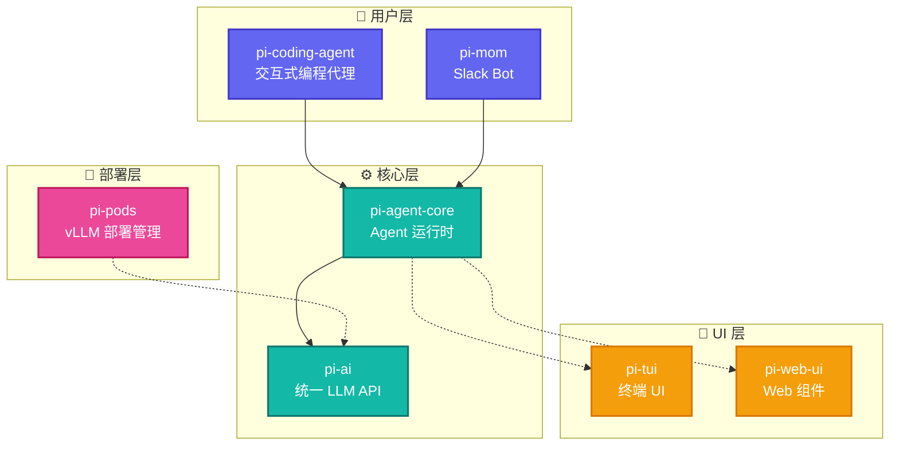

# Pi-Mono 深度洞察

## 概述

Pi-Mono 是一个用于构建 AI Agent 和管理 LLM 部署的工具集 monorepo。它提供了一套完整的工具链，从底层的多提供商 LLM API 到顶层的交互式编程代理 CLI。

## 架构全景



## 包结构

| 包 | 描述 | 状态 |
|---|---|---|
| [pi-ai](./01-pi-ai.md) | 统一多提供商 LLM API | ✅ 已分析 |
| [pi-agent-core](./02-pi-agent-core.md) | Agent 运行时与工具执行 | ✅ 已分析 |
| [pi-coding-agent](./03-pi-coding-agent.md) | 交互式编程代理 CLI | 📝 待完善 |
| [MainAgent 与 pi-coding-agent 关系](./08-MainAgent与pi-coding-agent关系.md) | OpenClaw 多智能体系统与 pi-coding-agent SDK 的关系 | ✅ 已完成 |
| [pi-tui](./04-pi-tui.md) | 终端 UI 库 | 📝 待完善 |
| [pi-web-ui](./05-pi-web-ui.md) | Web 聊天界面组件 | 📝 待完善 |
| [pi-mom](./06-pi-mom.md) | Slack Bot 集成 | 📝 待完善 |
| [pi-pods](./07-pi-pods.md) | GPU Pod 部署管理 | 📝 待完善 |

## 核心设计理念

### 1. 分层架构

Pi-Mono 采用清晰的分层设计：

- **基础层**: `pi-ai` 提供统一的 LLM 接口
- **核心层**: `pi-agent-core` 实现 Agent 运行时
- **应用层**: `pi-coding-agent`、`pi-mom` 等具体应用
- **UI 层**: `pi-tui`、`pi-web-ui` 提供界面能力

### 2. 事件驱动

Agent 的所有操作通过事件流暴露，支持：

- 流式响应 (`message_update`)
- 工具执行进度 (`tool_execution_update`)
- 状态转换 (`agent_start`/`agent_end`)

### 3. 多提供商抽象

`pi-ai` 统一了多家 LLM 提供商：

- OpenAI (GPT-4o, o1)
- Anthropic (Claude 系列)
- Google (Gemini)
- Azure OpenAI
- AWS Bedrock
- GitHub Copilot

### 4. 工具系统

Agent 通过工具系统扩展能力：

- 基于 JSON Schema 的参数验证
- 并行/串行执行模式
- 执行前后的钩子 (`beforeToolCall`/`afterToolCall`)

## 源码位置

```
pi-mono/
├── packages/
│   ├── ai/              # 统一 LLM API
│   ├── agent/           # Agent 运行时
│   ├── coding-agent/    # 编程代理 CLI
│   ├── tui/             # 终端 UI
│   ├── web-ui/          # Web 组件
│   ├── mom/             # Slack Bot
│   └── pods/            # Pod 管理
├── scripts/             # 构建脚本
└── package.json         # Monorepo 配置
```

## 与 OpenClaw 的关系

Pi-Mono 是 OpenClaw 的核心依赖库。OpenClaw 使用 Pi-Mono 的以下包：

- **`@mariozechner/pi-ai`**: 统一的 LLM API，用于模型调用和提供商管理
- **`@mariozechner/pi-agent-core`**: Agent 运行时，实现 OpenClaw 的 Agent 核心逻辑

OpenClaw 在此基础上构建了：
- 多通道支持（LINE, iMessage, Slack 等）
- Gateway 控制平面
- Plugin SDK 扩展系统
- Session 管理和持久化

## 参考链接

- [Pi-Mono GitHub](https://github.com/badlogic/pi-mono)
- [官方文档](https://shittycodingagent.ai)
- [Discord 社区](https://discord.com/invite/3cU7Bz4UPx)

---

## 最新更新（2026-03-24）

本章节内容相对稳定。pi-mono 仓库路径：`/Users/rainleon/data/devSpace/ageoss/openclaw_space/pi-mono/`。主要变化体现在与 openclaw 主仓库的集成方式上，详见 08-MainAgent与pi-coding-agent关系.md 的更新说明。
